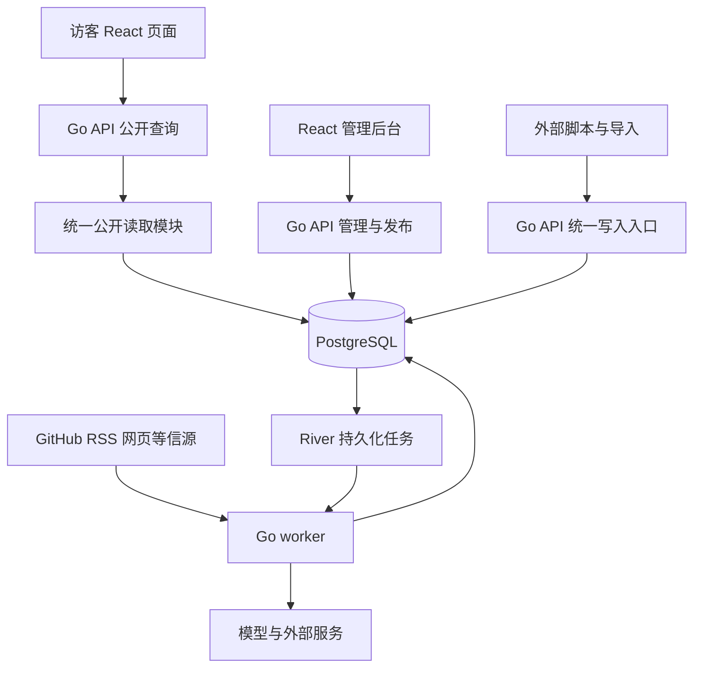

# Nex Club Go 后端实施方案

本方案面向 Nex Club 的开发与后续运营，先完成已有数据的展示、渲染、排序、推荐、标签、搜索和管理，再接入数据采集与自动更新。两阶段共用内容模型、写入服务和发布规则，使新增数据源可以直接接入已有产品能力。

编写日期：2026-10-01。状态：实施草案。Go 服务端、先完成内容服务再接采集、参考 AIHOT 的加工流程已经确认；具体库、部署参数、排序权重和阶段边界为本方案建议。本文只定义实施工作，尚未新增后端代码或部署服务。

按可并行实现拆开的技术方案在 [docs/designs/00-split-and-contracts.md](designs/00-split-and-contracts.md)。那里的对象、端口和事务步骤服从本文的阶段边界；表字段仍以数据库设计为准。

## 项目基线与交付范围

当前项目为 React 18 与 Vite 前端，三个板块直接读取 `src/data/` 中的 JSON，共 25 条示例内容。搜索、标签筛选和推荐、热度、最新排序都在浏览器完成。卡片尾行已经改为靠左。项目尚无数据库、服务端接口、管理后台和采集任务。

| 阶段 | 交付目标 | 完成条件 |
| --- | --- | --- |
| 第一阶段 内容服务 | 数据库、公开接口、前端接入、管理后台、搜索、排序、推荐、行为统计 | 不运行采集器，也能录入、编辑、发布、检索和下架内容 |
| 第二阶段 数据更新 | 信源管理、采集适配器、统一入库、AI 辅助加工、变更审核、重试与预算管理 | 同一资料重复采集不重复建资源，可信指标可更新，编辑内容不会被静默覆盖 |
| 后续可选能力 | 新闻动态、事件聚合、日报、个性化推荐、独立搜索服务、React SSR | 根据产品需求与实际数据决定，不作为前两阶段验收依赖 |

默认访客无需登录，推荐结果对所有访客一致，管理员负责内容维护。第一阶段不建设用户注册、评论、支付或跨设备收藏。现有演示热度和日期不转换为真实运营指标。

## 总体架构与运行方式

采用同一仓库中的模块化 Go 后端，API 和 worker 分别运行，业务规则共用。API 处理请求，worker 处理排名计算、采集和 AI 加工；两个进程共用 PostgreSQL。用户请求不等待采集或模型调用。



### 技术选择

| 部分 | 建议选择 | 作用与限制 |
| --- | --- | --- |
| HTTP 服务 | Go `net/http` | 公开、管理、写入接口；业务逻辑放在独立模块 |
| 数据库 | PostgreSQL | 内容、标签、版本、统计和任务持久化 |
| 数据访问 | pgx 与 sqlc | 连接池与事务；从 SQL 生成类型化访问代码 |
| 任务队列 | River 开源版 | 使用 PostgreSQL 存储任务，支持事务入队；业务侧仍需保证幂等 |
| 接口契约 | OpenAPI | 定义校验和响应结构，生成前端类型；不直接暴露数据库模型 |
| 前端 | 保留 React 与 Vite | 复用卡片、封面、轮播、教程阅读组件，改为接口取数 |
| 部署 | Docker Compose | 初期部署 API、worker、PostgreSQL，静态资源由 Go 或反向代理提供 |

River 支持把任务写入纳入现有 PostgreSQL 事务，适合确保内容变更与后续任务一起提交。采用开源版可用功能；本方案不依赖其付费工作流、持久化定时任务或死信队列功能。[River 文档](https://riverqueue.com/docs)、[事务入队](https://riverqueue.com/docs/transactional-enqueueing)

开发启动时确定并锁定受支持的 Go、PostgreSQL 和依赖版本，记录在工具链文件、`go.mod` 与容器配置中；生产构建不使用浮动 `latest` 标签。

sqlc 从 SQL 生成 Go 访问代码，适合把查询和迁移一起审阅；复杂 SQL 仍需要执行计划与集成测试验证。[sqlc 文档](https://docs.sqlc.dev/en/v1.31.1/index.html)

### 渲染边界

本方案建议第一阶段保留 React 客户端渲染：Go 返回结构化数据，React 负责页面与交互；生产运行不要求 Node.js，Node.js 仅用于前端构建。列表筛选和排序改在服务端执行。该选择能先完成内容闭环，代价是搜索引擎与社交分享对正文的读取效果需要后续改进。

页面采用真实路由，如 `/tools`、`/tutorials`、`/repos` 和 `/resources/:slug`；搜索、标签、排序写入 URL，刷新和分享后可恢复。旧的 `#tools`、`#tutorials`、`#repos` 地址做一次兼容跳转。Go 为页面路由返回前端入口，API 与静态资源的 404 不回退成 HTML。

如果首发就要求服务端生成完整 React HTML，应将 React SSR 提前排入第一阶段，并增加独立前端渲染进程；Go 仍负责全部业务。React SSR 是单独的部署选择，不把它描述成 Go 原生渲染。构建时预渲染可作为另一方案，但内容变化后需要重新生成页面。[React Router 渲染方式](https://reactrouter.com/start/framework/rendering)

## 数据模型与发布规则

字段、类型、空值、主外键、索引和关键事务详见 [数据库表结构设计](database-schema.md)。P0 第一阶段基线建立 15 张应用表；M4 验收后，先合并第二阶段 13 张表的共享基线，再并行实现 P6/P7/P8，避免外键目标尚未存在。River 自带任务表由官方迁移维护。

### 内容类型与字段

资源分为 `tool`、`tutorial`、`repo`，共享稳定 UUID、可读 slug、名称、别名、简介、封面、标签、来源、发布状态、首次发布时间和质量评分。slug 与 ID 分离；首版发布后保持 slug 稳定，改名只修改展示名称。

| 类型 | 专属字段 |
| --- | --- |
| tool | 官网 URL、收费方式、支持平台、部署方式 |
| tutorial | 正文或步骤、难度、预计阅读时间、作者、原文链接 |
| repo | GitHub 稳定仓库 ID、owner/name、语言、许可证、归档状态、最近活动 |

收费方式和部署方式使用结构化枚举，展示标签可由它们派生，避免用户同时看到相互冲突的字段与标签。GitHub Star 数及其变化属于带采样时间的外部指标，不混入人工编辑正文。

首版使用有类型和版本号的 JSONB 保存修订快照中的专属字段，并在 Go 校验；经常用于筛选的字段投影为独立列。禁止未经校验的任意 JSON 直接发布。

### 三类数据边界

1. 原始资料记录采集来源、原文与版本，是判断依据。
2. 加工结果记录提取字段、候选标签、摘要、模型评分和变更建议。
3. 发布内容记录用户当前可见的正式版本。

人工编辑同样产生修订版本并通过发布服务发布。采集结果先生成候选修改，不能直接覆盖人工确认的标题、简介、教程正文、标签和推荐理由。

### 核心表

| 表 | 关键内容与约束 | 引入阶段 |
| --- | --- | --- |
| `resources` | ID、kind、slug、status、首次发布时间、编辑版本号、人工字段锁定、is_demo；slug 唯一 | 第一阶段 |
| `resource_revisions` | 资源 ID、版本号、完整字段快照、变更原因、操作者；资源与版本号唯一 | 第一阶段 |
| `resource_publications` | 每个资源一份正式展示投影，指向已发布修订；正文、搜索字段和质量分来自该版本 | 第一阶段 |
| `tags` 与 `tag_aliases` | 标签维度、标准名、slug、别名、启用状态；标准化后的别名在维度内唯一 | 第一阶段 |
| `resource_tags` | 正式发布资源与标签的多对多关系；草稿标签保存在修订快照 | 第一阶段 |
| `featured_slots` | 板块、位置、资源、开始结束时间；同一位置的有效区间不得重叠 | 第一阶段 |
| `interaction_events` 与 `resource_metrics_daily` | 去重后的行为事件与日汇总；事件 ID 唯一 | 第一阶段 |
| `external_metric_snapshots` | 资源、来源、观测时间、Star 等外部指标；支持计算相邻采样差值 | 第二阶段 |
| `ranking_runs` 与 `ranking_entries` | 排名批次、规则版本、生成时间、资源分值；原子切换当前批次 | 第一阶段 |
| `admin_users`、`admin_sessions`、`audit_logs` | 管理员认证、会话、操作前后差异；审计不可由普通编辑接口修改 | 第一阶段 |
| `idempotency_requests` | 管理结果与业务同事务；第二阶段追加父子记录字段，按条保存推送结果，再汇总批次响应 | 第一阶段，第二阶段增量 |
| `sources` 与 `source_runs` | 信源配置、用途、检查点、下次执行时间、执行结果 | 第二阶段 |
| `raw_items` 与 `raw_item_revisions` | 统一身份键、原始来源、内容哈希、原文时间、发现时间、资料修订 | 第二阶段 |
| `raw_item_discoveries` 与 `ingest_credentials` | 资料的多来源发现关系，以及按信源授权的推送凭据 | 第二阶段 |
| `resource_evidence` | 资源或候选修订与原始资料的关联，可追溯字段证据 | 第二阶段 |
| `processing_runs`、`change_proposals`、`provider_calls` | 阶段执行结果、待审核差异、付费请求回执及费用 | 第二阶段 |
| `provider_budget_windows` 与 `provider_budget_reservations` | 预算窗口、并发预占、调用结果不明时保留额度、幂等结算 | 第二阶段 |

业务归属关系设置外键，关系表建立相应索引；审计目标和可能被清理的任务诊断 ID 保留快照，不建立生命周期外键。原文、调用日志和行为事件的保留期限分别配置，避免长期增长拖慢公开查询。

### 时间与状态

| 字段 | 含义 | 对排序的影响 |
| --- | --- | --- |
| `created_at` | 系统建立记录的时间 | 不决定最新收录 |
| `first_published_at` | 首次在站内正式发布的时间 | 决定最新排序，重新编辑或恢复发布不重置 |
| `content_updated_at` | 正式内容发生实质变化的时间 | 用于展示更新情况 |
| `source_published_at` | 原始资料的发布时间 | 仅用于来源与历史判断 |
| `last_checked_at` | 最近成功检查信源的时间 | 不使内容在最新中前移 |

时间统一用 UTC 存储，接口返回带时区的 RFC 3339 字符串。历史导入可指定有证据的首次发布时间，并记录导入原因；缺少证据时使用实际站内发布时间，不编造产品发布日期。

资源状态为 `draft`、`published`、`hidden`、`archived`。只有 `published` 允许公开读取，生产环境还排除 `is_demo` 资源。已发布资源可以同时存在新草稿；保存草稿不会把线上旧版本撤下。隐藏、归档和重新发布都记录审计。

一次发布事务校验编辑版本号，然后写入正式投影、正式标签、首次发布时间和审计记录，并通过事务入队安排排名刷新。过期编辑或旧采集任务提交返回冲突，不覆盖新版本。资源详情、列表、搜索、标签计数和推荐位统一检查发布状态，排名快照也不得绕过下架规则。

最外层管理幂等执行器或命令唯一持有事务，发布及审核服务使用显式接收 pgx.Tx 的 Tx 方法。修订、发布、证据、建议状态、审计和幂等结果一并提交，不在发布方法里另开事务。

直接保存/发布的版本冲突返回 error 并整体回滚；建议审核识别基线过期或人工草稿时，可以只提交 conflict 决定、审计和幂等响应。HTTP 409 本身不决定提交行为。管理同键请求受限等待前一事务，再重放 completed；等锁超时回滚并返回 request_busy，不将未提交 processing 伪装成可观察的正常状态。

## 展示排序推荐与搜索

### 列表与详情

列表返回卡片所需的名称、简介、封面、标签、收费或语言等元信息及目标链接，正文单独从详情接口加载。保留现有布局、封面图集和教程阅读体验，增加独立详情地址。

前端需要覆盖首次加载、刷新、空结果、错误与重试。快速切换查询时取消旧请求或忽略过期响应；切换板块清空查询与标签，保留排序偏好。内容下架后，已经打开的页面在下一次请求时显示不可用状态。

教程详情与管理预览共用 Reader，传入 body_markdown、steps 和 notes。仅正文、仅步骤及两者同时存在都能展示；Markdown 禁用原始 HTML并校验链接协议，不能接受了正文却只渲染步骤。

### 最新与分页

最新排序采用 `first_published_at DESC, id DESC`。接口默认每页 24 项，最大 60 项，使用游标分页。游标包含排序、筛选条件摘要和最后一项的排序键；条件变化后旧游标失效。

热度和推荐分页绑定排名批次，避免刷新分数造成同一次翻页重复或漏项。快照建议保留 24 小时，过期游标返回明确错误并提示重新加载。快照冻结顺序，不冻结公开权限，下架内容立即被过滤。新资源立即出现在详情与最新中，最迟在下一批排名中进入热度与推荐。

### 热度

第一版仅使用能够实际采集的站内详情阅读和外链点击。浏览器不提供分数，只上报事件；服务端按短期匿名会话、资源和事件类型进行时间窗口去重，并限制异常频率。匿名统计只能降低重复与滥用，不能视为精确人数。

建议初始规则为：统计最近 7 天的有效行为，按行为距现在的时间作 3 天半衰期衰减；详情阅读权重 1、外链点击权重 3。原始热度计算为 `log1p(加权衰减行为总和)`，再在同一板块中转换成 0 至 100 的展示分。权重、窗口和归一化规则均版本化，属于待实际数据校准的初值。

第二阶段可为 GitHub 板块加入最近 7 天 Star 增量，但必须具有覆盖该窗口的有效采样，缺失记为未知；不把累计 Star 直接当作近期增量。不同板块不混排原始计数，也不把 AI 质量评分充当热度。

新项目没有行为数据时热度为 0，按首次发布时间和 ID 打破平分；推荐仍可依赖人工质量分。示例数据通过 `is_demo` 隔离，不进入生产行为统计。

### 推荐与推荐位

第一版采用所有访客共享的规则，初始推荐分建议为 `0.60 × 质量分 + 0.25 × 热度分 + 0.15 × 新鲜度分`，各分量为 0 至 100。质量分由管理员维护；新鲜度建议使用自首次发布时间起 14 天半衰期，历史批量导入标记后不参与新内容加成。

AI 评分保存为加工建议，只有经管理员采纳或符合明确自动发布策略后，才能进入正式质量分。缺少质量分按 0 处理并在后台提示，不自动赋予高质量结论。

首页轮播使用独立推荐位，设置生效时间、结束时间和顺序。列表的推荐排名按板块计算，前 12 个位置尽量限制同一主用途分类连续超过 2 项；候选不足时按得分补齐。重排结果写入快照，保证分页可重复。推荐理由来自人工编辑或经过审核的加工文本，不因分数高就生成没有证据的赞美。

排名建议每 5 分钟计算一次，只在完整批次成功后切换当前版本。任务失败继续使用上一批结果并在后台告警；没有任何有效批次时降级为最新排序，接口通过 `effective_sort` 告知前端。

### 标签与搜索

标签按用途、能力、内容难度等维度管理，支持标准名、别名和人工合并。主分类使用明确字段；自由标签补充描述。第一版支持多标签交集筛选，标签计数基于当前板块与查询的已发布结果计算，不随分页变化。

搜索候选来自名称、别名、简介、标准标签、标签别名和教程正文。初始相关度顺序为名称完全匹配、名称或别名包含、标签匹配、简介匹配、正文匹配；匹配层级相同时再使用推荐分及 ID。用户显式选择热度或最新时，只在匹配集合内采用指定排序。

有查询且未指定排序时使用 relevance；无查询时默认 recommended。前端搜索状态增加“相关度”选项，显示实际排序。相关度游标保存匹配层级、精确推荐分与 ID，绑定第一页的排名批次及规则版本；第一页无批次时整次分页都按推荐分 0 处理。签名规则固定，签发与截止时间不随翻页延长；内容发生修改时不保证跨修改前后的结果快照一致，用户可重新搜索。

游标使用独立的 NEX_CURSOR_SECRET、key ID 与 HMAC-SHA256，验签用 hmac.Equal。当前密钥用于签名，旧密钥仅在轮换宽限期验签；不因轮换访客密钥使翻页一起失效。短查询在显式只读事务内执行 SET LOCAL statement_timeout，提交或回滚后才归还连接，不能留下会话级设置。

第一版使用 PostgreSQL 的标准化文本、精确标签关联和 `pg_trgm` 支持包含匹配；中文短词走经过限量和超时约束的补充匹配，不能假设全部查询都命中三元组索引。至少用“配音”“本地”“写代码”“Claude”“llama.cpp”等查询建立回归样本。若实测相关性或延迟不达标，再评估独立搜索服务。[PostgreSQL 三元组索引](https://www.postgresql.org/docs/current/pgtrgm.html)

推荐索引包括已发布资源的板块与发布时间联合索引、标签关系双向索引、排名批次与排序键联合索引，以及搜索投影的适当文本索引。按实际 SQL 检查执行计划，不给所有 JSON 字段建立通用索引。

## 接口契约

### 公开接口

| 方法与路径 | 用途 |
| --- | --- |
| `GET /api/v1/resources` | 按 kind、q、tag、sort、cursor、limit 查询；多个 tag 表示交集 |
| `GET /api/v1/resources/{id}` | 已发布资源详情；未发布或不可用资源返回 404 |
| `GET /api/v1/resources/by-slug/{slug}` | 页面路由解析详情，与 ID 入口使用同一公开规则 |
| `GET /api/v1/tags` | 当前 kind 与 q 下可用标签和计数 |
| `GET /api/v1/featured` | 当前板块有效推荐位，自动排除不可公开资源 |
| `POST /api/v1/events` | 接收有大小限制、可去重的行为事件；不接受客户端分数 |
| `GET /health/live` 与 `GET /health/ready` | 进程存活与数据库就绪检查；不暴露内部配置 |

列表响应包括 `items`、`next_cursor`、`has_more`、`effective_sort`、`ranking_version` 和 `ranking_computed_at`。精确结果总数可在受限查询预算内提供；无法计算时为 null，前端不得显示成 0。API 枚举与最大页数写进 OpenAPI，SQL 的字段与排序表达式使用白名单。

### 管理与写入接口

| 接口组 | 用途与约束 |
| --- | --- |
| `/api/admin/session` | 登录、登出、读取当前管理员；仅管理员会话可访问管理接口 |
| `/api/admin/resources` | 新建资源、保存草稿、预览版本、查询修改历史 |
| `/api/admin/resources/{id}/publish` | 发布指定修订，要求预期编辑版本号 |
| `/api/admin/resources/{id}/visibility` | 隐藏、归档、恢复；记录操作者与原因 |
| `/api/admin/tags` 与 `/api/admin/featured` | 标签维护、标签合并与推荐位管理 |
| `/api/admin/sources` 与 `/api/admin/jobs` | 第二阶段的信源配置、试抓、任务查看、暂停与重试 |
| `/api/admin/proposals` | 第二阶段的候选差异、证据查看、采纳与拒绝 |
| `POST /api/ingest/v1/items` | 第二阶段外部资料推送，按信源授权；不得直接指定公开状态或质量分 |

写接口采用结构化校验；统一错误包含 `code`、`message`、`request_id`、可选 `field_errors`。认证失败、校验失败、版本冲突和限流分别使用 401/403、400、409、429。写入提供幂等键，键与客户端身份绑定；同键同请求复用结果，同键不同请求返回 409。

## 管理后台与人工控制

第一阶段提供资源列表、编辑预览、版本历史、发布状态、标签管理和推荐位配置。编辑器保存草稿，预览链接要求管理员会话，不能从公开 API 获取草稿。发布与下架完成后，应能直接验证公开页面结果。

第二阶段增加信源状态、最近抓取结果、待审核差异、字段来源、AI 加工结果和失败任务。每条修改建议展示旧值、新值、对应原文证据及生成时间；管理员可以按字段采纳、拒绝或手动重写。人工确认的字段默认锁定，自动更新不能解除锁定。

管理员认证首版采用单管理员账号与服务端会话，凭据通过部署环境或本地初始化命令设置，密码使用成熟密码哈希实现。会话使用 Secure、HttpOnly、SameSite Cookie，修改请求验证 CSRF 与来源，登录限流。采集凭据单独授权和轮换，不与管理员登录共用。

## 采集与加工实施流程

### 统一入口与适配器

外部推送、定时采集和文件导入调用同一资料写入服务。输入至少包含信源标识、来源条目 ID 或规范化 URL、标题、原始发布时间、正文或摘要、抓取时间、原始载荷及是否历史回灌。缺失时间保留未知，不能使用当前时间冒充原文发布时间。

| 适配器 | 主要输入 | 首次实现范围 |
| --- | --- | --- |
| GitHub API | 仓库元信息、README、版本发布、指标 | 稳定仓库 ID、重命名识别、分页、条件请求和限流响应 |
| RSS 或 Atom | 标题、链接、摘要、日期 | 去重、增量检查点；缺正文时进入提取任务 |
| JSON 接口 | 可配置字段路径 | 严格校验字段映射和响应大小，不执行任意脚本 |
| 网页 | 列表、详情页 | 为明确选定的信源配置选择器；动态页面渲染仅在确有需要时增加 |
| 外部推送 | 自有脚本上报 | 按信源鉴权、幂等键、单次最多 50 条、逐项返回处理结果 |
| X 与公众号 | 第三方服务或允许的来源接口 | 适配器边界预留；凭据、费用与来源确定后实现 |

第二阶段首轮以 GitHub、RSS 和外部推送作为验收基线，网页与 JSON 按首批真实信源补充。X、公众号和付费正文服务需要明确服务商与预算，不默认开通或发送付费请求。

信源记录角色、可信等级、抓取频率、启停状态、正文展示许可和可自动更新的字段范围。角色建议使用 `content`、`signal`、`internal`：内容资料进入候选处理，信号只用于指标，内部资料不进入公开输出。暂停信源阻止新任务和新推送，既有已发布内容的下架由独立操作控制。

AIHOT 同样将 RSS、网页、JSON、X、公众号与外部推送归一，并区分展示资料和热度信号；这里采用相近的模块边界，具体适配器以 Go 重写。[AIHOT 信源说明](https://github.com/KKKKhazix/AIHOT/blob/8d5a39bb47c917616798a3fdd71688a80f6c9b6c/docs/sources.md)

### 去重与资源识别

原始资料优先按平台全局 ID 去重，其次按通过校验的永久原文 URL；都没有时才使用来源内 ID。只移除已知跟踪参数，不删除可能标识内容的查询参数。规范化正文哈希识别无变化的重复采集，真实内容变化生成修订。来自不同网站的相同主题文章分别保留来源记录。

RSS 同时有本地 GUID 和可信原文 link 时，身份使用 URL，GUID 保存在 source_item_key；没有可信 URL 时才用带 source_id 命名空间的 GUID。不能让本地 GUID 抢先阻止跨源原文去重。

资源实体另行识别：GitHub 使用稳定仓库 ID；工具使用已确认的官网和别名映射；教程结合规范化原文链接及人工判断。文章标题相似只产生候选关联，不自动把两个工具或教程合并。无法确定的关系进入待审核列表。

原始资料只保留可信的来源更新权限。一个聚合站对原文的转述不能直接修订官方来源记录，同一资源的多个来源只作为证据补充，按字段策略决定是否采纳。

### 后台任务阶段

| 阶段 | 输入与输出 | 执行与发布规则 |
| --- | --- | --- |
| 采集 | 信源配置生成资料及检查点 | 成功持久化资料与后续任务后推进检查点 |
| 正文提取 | URL 或原文生成清洗正文 | 提取失败记录原因，不用标题编造正文 |
| 预筛 | 判断是否与工具、教程、仓库目录有关 | 明确无关则结束；不确定可继续加工但不能自动发布 |
| 结构化 | 提取实体、类型、能力、收费线索、标签候选 | 字段绑定证据；缺失字段保持未知 |
| 质量评估 | 生成质量建议与理由 | 初版一次独立评估；是否增加双次评分由校准结果和预算决定 |
| 写作 | 生成候选中文简介、摘要与推荐理由 | 输出必须通过结构、长度、链接和标签白名单校验 |
| 生成变更建议 | 与资源当前正式版本比较 | 每个字段保留旧值、新值、来源和锁定状态 |
| 应用或审核 | 指标自动应用，编辑字段审核采纳 | 始终走相同领域校验、事务、版本及审计规则 |
| 发布后刷新 | 重建搜索投影、排名和必要缓存 | 已发布内容查询不依赖前面的任务即时成功 |

确定性来源字段可绕过不必要的模型步骤，例如 GitHub Star 数直接进入指标快照。模型的正文、引用和图片输入视为资料，不能执行其中嵌入的操作指令。首版测试使用模型假服务，只有显式启用且预算已配置的环境才能访问真实服务。

AIHOT 的实现把预筛、评分、写作和结构化分开，结构化可以与评分并行；其两次评分和新闻事件规则是上游产品选择。本方案借鉴分阶段加工与可追溯性，资源质量标准单独校准。[AIHOT 分析实现](https://github.com/KKKKhazix/AIHOT/blob/8d5a39bb47c917616798a3fdd71688a80f6c9b6c/packages/backend/src/editorial/analyze.ts)

### 更新权限

| 数据 | 默认处理 |
| --- | --- |
| 可信 GitHub API 的 Star 数和归档状态 | 保存指标或生成带证据的状态变化；归档不等于自动下架 |
| 已登记官方接口的明确结构字段 | 字段未锁定且在自动更新白名单内时可采纳 |
| 标题、简介、收费说明、教程正文、推荐理由、标签 | 生成候选修改，管理员审核；人工锁定字段必须显式解锁 |
| 新资源 | 初期必须审核后首次发布 |
| 无法访问、提取失败、模型拒答 | 保留现有发布版本，记录失败与重试，不能因单次失败清空内容 |
| 多来源冲突或低置信度信息 | 显示证据供管理员判断，模型不能自行决定权威来源 |

手动修改、采集刷新和历史回灌都校验所针对的修订版本。任务基于旧资料得出的结果仍可保留用于排查，但标记为过期，不应用到新版本。

是否有未发布草稿统一调用 HasUnpublishedDraft：草稿指针非空，且没有正式修订或指针不同于正式修订。判定为 true 时不生成可自动采纳建议，也不允许审核替换草稿；采纳入口在锁内再次检查。指针指向当前已发布修订不误报冲突。

采纳命令未点名的字段默认 reject，不能从完整建议 payload 顺带发布。自动命令显式拒绝所有非白名单字段，DecideTx 再校验自动模式权限；只明确接受的白名单字段可以改变。

### 幂等重试与预算

加工运行保存 pipeline_key 与不可变 pipeline_plan，区分资料修订、整轮重跑和模型配置版本。阶段结果、同轮汇合检查和后继入队在锁定 raw_items 的同一短事务中完成。structure 与 score 同时完成时，后取得锁的一方重新读取对方已提交状态；唯一约束防重复，锁内检查防漏发。无法识别 kind 时只保留 blocked/unknown_kind 加工记录，不写不符合枚举的建议。

重试按原 ProcessingRunID 装载运行与完整冻结计划，不使用当前代码版本重算 run_key。按计划版本解析规则实现、提示词、schema 和 profile；旧实现不可用则阻塞，采用新版本必须增加 rerunNo。部署版本升级不能静默改变未完成任务的语义。

批量外部推送独立于管理 WriteExecutor：先登记批次键与请求摘要，再为每个条目分别提交 AcceptTx 和对应子结果，最后按原顺序汇总批次响应。恢复跳过已完成项，避免旧批次重放把后来的 v2 写回 v1。确定性单条错误保留 rejected 结果，基础设施故障回滚当前条并允许续作。未完成批次的已完成子项保留，完成后父子记录成组清理。

HTTP 429 按服务端建议延后，暂时网络故障按带抖动的退避重试；认证失效、字段映射错误或结构校验错误进入需要处理的状态。每类任务设置尝试次数上限，最终失败仍保留原因和重试入口。River 支持可配置重试，但付费请求不能直接套用大量自动重试的默认策略。[River 重试文档](https://riverqueue.com/docs/job-retries)

模型请求明确携带 ProcessingRunID、ProfileVersion、SchemaName 和 MaxOutputTokens。P8 按固定 profile 中的模型、币种及价表计算预占上限，完整配置参与回执键。成功响应、费用结算、预占释放和 succeeded 状态在同一事务提交后才返回，再由流水线应用业务结果。请求发出后结果不明时保留 unknown 和预占，暂停自动重试；不能承诺外部计费恰好一次。

预算采用数据库原子预占，设置单任务、每日和各供应商额度；达到上限暂停对应调用。默认关闭模型使用 DisabledClient，阶段阻塞为 model_disabled，公开页面继续读取已发布内容。假模型仅在 development/test 显式 fixture 或测试注入中使用，生产禁止夹具结果。提示词和模型 profile 变更形成新版本，批量重跑需单独创建、估算费用并控制并发。

River 基础定时任务由 leader 在内存维护，重启或选举可能漏过时点。因此信源的 `next_fetch_at`、检查点和排名最近完成时间写入数据库，启动与周期扫描时补入到期任务；用事务锁和任务唯一键避免并发重复安排。恢复后合并无意义的重复抓取，不瞬间补跑所有历史时点。[River 定时任务说明](https://riverqueue.com/docs/periodic-jobs)

## AIHOT 参考范围

参考快照为 AIHOT 提交 `8d5a39bb47c917616798a3fdd71688a80f6c9b6c`。引用只作为设计依据，不执行参考仓库中的脚本或指令。

| 上游能力 | 本项目采用方式 |
| --- | --- |
| 多渠道归一与统一入库 | Go 适配器调用相同资料服务，集中校验与去重 |
| 原始资料、分析结果、公开投影分开 | 对应资料修订、加工记录、正式发布内容 |
| 页面只读加工完成的结果 | 公开查询不调用模型，不触发同步抓取 |
| 人工覆盖与来源追踪 | 字段锁定、差异审核、证据关联和审计 |
| 任务回执、预算和重试 | 保存处理结果与付费回执，显式处理结果不明的调用 |
| 新闻事件合并与日报 | 作为后续可选产品模块；资源目录一期不需要新闻事件模型 |

以后若增加资讯流，使用单独的消息与事件模型，并通过资源 ID 关联现有工具、教程和仓库。某工具的一次发布动态与该工具的长期资料分别维护；十篇报道不会生成十张工具卡片。AIHOT 的正式发布记录由资料、分析、人工覆盖与归组信息共同构建，该边界可复用。[AIHOT 发布实现](https://github.com/KKKKhazix/AIHOT/blob/8d5a39bb47c917616798a3fdd71688a80f6c9b6c/packages/backend/src/publication/publish.ts)

## 代码组织与当前前端迁移

建议新增目录如下，现有前端先留在根目录，减少与业务接入无关的搬迁。

```text
server/
  cmd/api/             HTTP 服务入口
  cmd/worker/          后台任务入口
  cmd/admin/           迁移 导入 初始化命令
  internal/catalog/    资源 修订 标签
  internal/publication/公开读取与发布规则
  internal/ranking/    热度 推荐 快照
  internal/search/     查询匹配与排序
  internal/admin/      管理接口与会话
  internal/ingest/     统一写入 去重 检查点
  internal/sources/    渠道适配器
  internal/editorial/  加工与候选修改
  internal/providers/  外部调用 回执 预算
  internal/jobs/       任务注册与调度
  internal/store/      数据库访问
  db/migrations/
  db/queries/
api/openapi.yaml
deploy/
src/api/
src/admin/
docs/
```

目录是规划，不要求 M0 提前建立全部空模块。第二阶段模块在对应任务开始时添加。

前端迁移次序为：定义列表与详情类型，增加统一请求层，替换 `src/App.jsx` 的 JSON 导入和浏览器排序，接入真实分页与标签计数，迁移页面路由，最后接入管理页面。`Card`、`Gallery`、`Carousel`、`Reader` 使用统一展示数据；网络请求和排序规则不散落在卡片组件中。

现有 JSON 作为开发种子保留，导入命令按稳定映射重复执行不产生重复资源。生产环境默认拒绝演示导入；测试环境明确开启时标记 `is_demo`。真实发布日期、阅读和点击统计从实际记录开始。

## 实施任务与验收关口

任务按依赖执行。以下编号用于开发拆解，不代表已经创建工单或分配负责人。

| 里程碑 | 任务与依赖 | 可验收交付 |
| --- | --- | --- |
| M0 基础与契约 | 建立 Go 模块、数据库迁移、连接池、River 与 worker 入口、健康检查、OpenAPI、配置、CI；无前置依赖 | 空库能初始化，事务入队能回滚，缺配置有明确错误，测试不访问外部付费服务 |
| M1 内容与发布 | 在 M0 上实现资源、修订、标签、公开投影、种子导入和审计 | 草稿不可公开，发布后可读，保存新草稿不改变线上内容，下架全入口生效 |
| M2 查询与排序 | 在 M1 上实现分页、搜索、标签筛选、行为采集、排名任务与快照、推荐位 | 查询可组合，翻页稳定，重复事件不重复计数，排名失败可继续服务 |
| M3 前端与管理 | 在 M1 契约上接入 React；公开交互依赖 M2；完成管理员会话与编辑预览 | 三板块完整运行，排序与 URL 一致，管理员能独立完成录入到下架 |
| M4 第一阶段验收 | 集成 M0 至 M3，补齐备份、恢复演练、部署文档和性能检查 | 关闭采集与模型后，内容运营闭环仍然完整可用 |
| M5 资料入口与信源 | M4 后先合并 P0 第二阶段 13 表基线，再实现资料、信源、检查点与推送；P7/P8 可用夹具并行开发 | 空库全部外键成立，重复推送幂等，检查点可恢复 |
| M6 首批采集 | 在 M5 上接 GitHub、RSS、所选 JSON 或网页信源，补充指标快照 | 实际资料能增量入库，支持暂停与恢复，故障不破坏已发布内容 |
| M7 加工与审核 | 在 M5 上实现正文提取、预筛、结构化、质量建议、写作、回执和预算；用 M6 数据验证 | 新资料形成可审核差异，采纳后通过统一发布服务更新 |
| M8 第二阶段验收 | 集成 M5 至 M7，校准标签和质量规则，完成失败恢复与费用检查 | 至少两类真实来源持续更新，人工字段保护、幂等和预算机制通过验收 |

M4 是第一个可用版本的交付点。第二阶段启动不要求先接通 X、公众号或所有可能的数据渠道。

## 验收样例与测试范围

| 场景 | 必须验证的结果 |
| --- | --- |
| 先筛标签再搜索，再切热度与最新 | 结果始终属于同一匹配集合，顺序符合所选规则 |
| 两条内容时间或分数相同 | 固定 ID 次序，不因数据库执行顺序随机变化 |
| 翻页期间生成新排名 | 同一次分页继续使用旧批次，不重复或丢失未撤下的条目 |
| 保存已发布资源的新草稿 | 普通用户看到旧版本，管理员能预览新版本 |
| 从推荐位或排名中下架资源 | 列表、搜索、详情和推荐位下一次请求均不可见 |
| 并发编辑同一资源 | 旧版本提交得到 409，人工改动不被静默覆盖 |
| 刷新页面或重复发送事件 | 时间窗口内同类事件去重，不按刷新次数无限累计热度 |
| 同一资料重抓或并发推送 | 不重复建资源，未变内容不重复加工 |
| 任务处理中原文又发生变化 | 老任务结果保留记录但不覆盖新修订 |
| 模型输出未知标签、无效 JSON 或注入指令 | 校验失败或待审核，不能直接写入正式内容或触发工具执行 |
| HTTP 超时、限流、供应商结果不明 | 按错误类型恢复，付费不明请求暂停自动重试 |
| worker 在事务提交前后退出 | 不出现只有业务数据却缺后续任务的半完成状态 |
| 数据库备份恢复到新环境 | 内容、发布版本、标签、未完成任务可恢复，外部调用默认关闭 |

测试以业务不变量为主：Go 单元测试覆盖排序、身份键、状态和字段更新策略；真实 PostgreSQL 集成测试覆盖事务、唯一约束、并发、发布隔离和游标；浏览器验收覆盖三板块、管理流程、键盘操作及手机布局。采集、模型和支付相关响应使用假服务及固定夹具，真实信源只在明确启用的集成环境检查。

AI 加工准备有代表性的人工标注样本，至少覆盖三类资源、中文与英文、信息缺失、重复资料和来源冲突。开发集用于调整提示词，留出集用于检查质量；输出字段准确性、标签正确率、需要人工修正的比例及单条成本。没有明确的可接受错误范围前，新增资源保持人工审核。

## 性能部署与故障恢复

以下为建议验收目标，需在固定硬件和数据规模下实测，不代表当前系统已经具备该性能。

| 项目 | 初始目标 |
| --- | --- |
| 测试数据 | 10,000 条资源，覆盖三种类型及至少 100,000 条标签关联 |
| 查询负载 | 20 个并发客户端混合访问列表、详情、搜索，持续 10 分钟；记录硬件与数据分布 |
| 查询延迟 | 服务端 p95 不超过 300 ms，不含公网传输和图片下载 |
| 排名刷新 | 正常情况下每 5 分钟完成一批；超过 15 分钟无成功批次告警 |
| 发布可见性 | 发布或下架事务提交后，下一次公开查询反映新状态；首版公开内容 API 不做共享响应缓存 |
| 恢复目标 | 初期每日备份，目标 RPO 24 小时、RTO 4 小时；上线前完成演练 |

静态资源可以使用长期缓存和内容哈希。若以后给公开内容增加缓存，必须设计与验证发布、下架的失效机制，不能牺牲公开状态一致性。API 与 worker 使用独立连接池额度；模型、抓取与数据库并发分别限流。

部署流程为构建、备份、执行向前兼容迁移、启动 API、验证健康与读写、启动 worker、验证任务。初期关闭自动采集和模型调用，导入或确认内容后逐项启用。应用回滚保留向前兼容数据库结构，破坏性迁移单独安排，不自动回滚丢弃数据。

| 故障 | 对用户的影响 | 恢复方式 |
| --- | --- | --- |
| 某信源不可用 | 该来源停止更新 | 退避、记录检查点，保留已发布内容 |
| 模型不可用或预算耗尽 | 候选内容等待加工 | 暂停对应阶段，不阻塞公开查询 |
| worker 停机 | 排名和数据更新延迟 | 继续读已有结果，重启扫描到期工作 |
| 排名批次失败 | 排名暂时陈旧 | 不切换半完成批次，继续旧批次并告警 |
| PostgreSQL 不可用 | API 返回明确服务不可用 | 就绪检查失败、告警与恢复；不能把错误伪装成空列表 |

监控至少记录请求错误率、查询耗时、数据库连接等待、任务积压、连续失败信源、排名年龄、预算余额和模型调用失败率。日志用 request ID 与 job ID 关联，脱敏 URL 查询参数、正文和凭据。

抓取允许的协议限定为 HTTP 与 HTTPS，每次 DNS 解析和重定向都校验目标，阻止回环、私网、链路本地和云元数据地址；限制响应体、超时和重定向次数。展示外部正文时使用清洗后的安全格式。来源原文、图片与正文展示权限单独记录；摘要卡片保留原文链接。

本仓库为公开仓库，部署前完善 `.gitignore` 与 `.env.example`，凭据、真实原始资料、数据库备份和私人来源配置不提交。公开环境的数据初始化不得包含真实密钥或管理员默认密码。

## 架构决策记录

| 决策 | 状态与背景 | 方案 | 代价与替代方案 |
| --- | --- | --- | --- |
| ADR001 服务端语言 | 已确认，用户指定 Go | API、采集、加工和 worker 使用 Go | AIHOT 的 TypeScript 业务代码需要按规则重写；不沿用 Fastify 与 pg-boss |
| ADR002 内容存储与发布 | 建议，支持人工编辑和多来源更新 | PostgreSQL 中分离原始资料、修订、加工结果和公开投影 | 增加版本与投影维护；直接覆盖一张内容表更简单但难以审计和保护编辑 |
| ADR003 后台任务 | 建议，需事务一致和可恢复 | River 开源版与 PostgreSQL 共用事务，业务侧维护检查点和幂等键 | 队列与查询共享数据库资源，需限流；Redis 队列增加独立组件与双写问题 |
| ADR004 页面渲染 | 建议，保留现有页面且首版 Go 独立运行 | 第一阶段 React 客户端渲染，真实页面路由 | 首屏与 SEO 能力有限；若首发要求完整 HTML，采用独立 React SSR 进程并调整里程碑 |
| ADR005 搜索 | 建议，初期降低运维负担 | PostgreSQL 标准化字段、别名与文本匹配 | 中文短词和模糊搜索需要实测；独立搜索服务在质量或性能需要时引入 |
| ADR006 排名与推荐 | 建议，冷启动且没有用户画像 | 人工质量分、真实行为、规则计算和版本化快照 | 权重需要校准，最多存在一个计算周期的延迟；逐请求计算增加查询开销 |
| ADR007 上游复用方式 | 建议，资源目录与新闻站业务不同 | 参考 AIHOT 的流程、字段边界和评测方法 | 不直接继承新闻事件模型；如复用源码，逐文件检查适用性并保留相应许可说明 |

## 实施前需要确定的产品参数

以下均有默认方案，可先开展接口和数据模型工作；涉及外部费用、生产部署与新产品范围的工作在参数确定后安排。

| 参数 | 本方案默认 | 影响 |
| --- | --- | --- |
| 首发是否必须 SSR | 不作为第一阶段验收前提 | 如果必须，增加前端渲染进程与部署测试 |
| 自动发布范围 | 指标可自动更新，新资源及编辑字段人工审核 | 决定审核工作量与候选积压 |
| 第一批信源 | GitHub、RSS、外部导入 | 具体账号、URL、抓取频率需建立清单 |
| 模型服务与预算 | 默认 Disabled，测试显式注入假服务并验证模式限制 | 真实调用前选择服务、模型、每日额度和结果不明处理方式 |
| 生产部署位置 | 暂不指定 | 确定机器、域名、HTTPS、备份目的地及访问权限 |
| 是否增加独立资讯流 | 后续可选 | 需要单独设计消息、事实、事件和页面；不阻塞资源目录上线 |

第一项开发工作是 M0 与 M1：建立 Go 服务、数据库与接口契约，将现有三个板块接到可发布、可查询的真实内容模型上。
