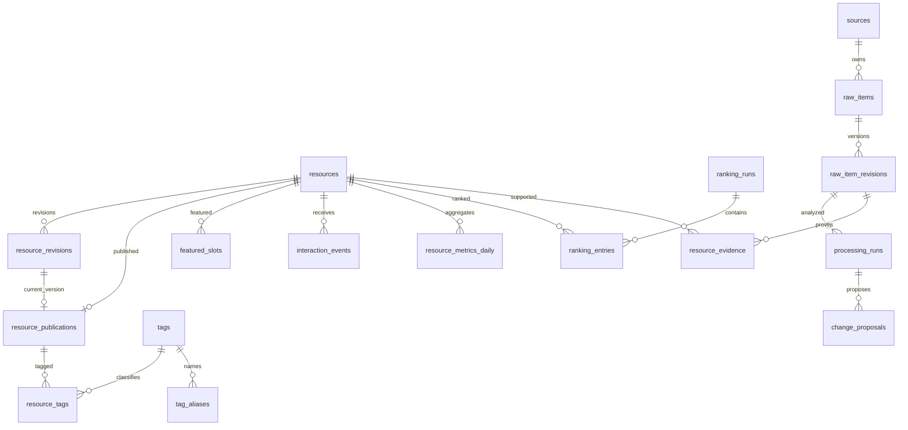

# Nex Club 数据库表结构设计

本文件将 [Go 后端实施方案](backend-implementation-plan.md) 中的表清单细化为 PostgreSQL 字段、关系和约束，供数据库迁移与接口实现使用。状态为设计草案，尚未创建数据库或执行迁移。

第一阶段包含 15 张应用表，由 P0 基线创建；第一阶段验收后，P0 的第二阶段 schema 基线按外键顺序增加 13 张表，供 P6/P7/P8 并行实现。River 自带的任务表由其官方迁移维护，不重复设计；schema migrations 表由所选迁移工具维护。文中使用 Postgres 最佳实践检查字段类型、关联索引和事务边界。

## 通用约定

- 对外业务实体使用 Go 生成的 UUID；高写入审计使用 bigint identity。所有时间使用 timestamptz，数据库会话时区为 UTC。
- 字段表内以斜线组合展示的字段都应拆成独立列，不能创建带斜线的列名。标为必填的字段设置 NOT NULL；没有写默认值的字段由调用方提供。
- 状态使用 text 加 CHECK 白名单；金额使用精确 numeric，数值与计数增加合法范围约束。JSONB 保留结构版本并验证对象或数组类型，业务字段仍由 Go 完整校验。
- 有生命周期归属的业务关联建立外键。审计目标、诊断任务 ID 和已认证主体快照是明确例外，避免清理任务或归档历史时删除审计。
- 默认禁止硬删除资源、修订、信源、管理员和证据。常规外键采用 RESTRICT；仅会话等短期数据和过期排名子表按保留策略清理。
- 唯一约束使用数据库约束处理并发。CHECK 只检查本行；跨表状态由外键、锁和事务保证。[PostgreSQL 约束](https://www.postgresql.org/docs/current/ddl-constraints.html)

## 核心关系



该图突出内容链路，认证、幂等、回执与预算关系见各表约束。资源创建时可以没有草稿；第一次保存后建立修订，首次发布后才有发布投影。

## 第一阶段 内容展示与运营

### resources

资源身份与发布状态。内容字段由修订表保存，前台从发布表读取。

| 字段 | PostgreSQL 类型 | 空值与默认值 | 含义与约束 |
| --- | --- | --- | --- |
| id | uuid | 必填，Go 生成 | 主键 |
| kind | text | 必填 | tool、tutorial、repo；创建后不变 |
| identity_key | text | 可空 | 已确认的稳定资源身份，如 github:<仓库ID>；新建纯人工草稿可暂缺 |
| slug | text | 必填 | 全局唯一的小写 URL 标识，发布后保持稳定 |
| status | text | 必填，draft | draft、published、hidden、archived |
| draft_revision_id | uuid | 可空 | 当前草稿；与 id 组成复合外键，指向本资源修订 |
| edit_version | bigint | 必填，1 | 大于 0，每次修改或状态变化递增，用于乐观锁 |
| field_locks | text[] | 必填，空数组 | 人工保护的字段路径，Go 只允许白名单路径 |
| is_demo | boolean | 必填，false | 生产公开查询排除演示内容 |
| freshness_eligible | boolean | 必填，true | 为 false 时推荐新鲜度记 0。历史种子导入置 false，真实新发布保持 true。见技术方案 P1 |
| first_published_at | timestamptz | 可空 | 第一次发布时赋值，之后不随编辑重置 |
| created_at / updated_at | timestamptz | 必填，now() | 创建与最近一次管理修改时间 |
| last_checked_at | timestamptz | 可空 | 最近成功检查来源时间，不参与最新排序 |

唯一约束：`slug`、`(id, kind)`；部分唯一索引 `(kind, identity_key) WHERE identity_key IS NOT NULL` 防止相同实体重复建资源。GitHub 类型发布时必须具备已确认身份键；官网和教程身份由来源映射及人工确认产生。索引：`(kind, first_published_at DESC, id DESC) WHERE status = 'published' AND NOT is_demo`，后台索引 `(status, updated_at DESC, id)`。`draft_revision_id` 的归属约束在修订表创建后补建。发布状态与发布记录是否存在，由发布事务保证，不能用跨表 CHECK。

### resource_revisions

不可变的资源修订快照。每次保存新草稿插入新行，保留旧版本。

| 字段 | PostgreSQL 类型 | 空值与默认值 | 含义与约束 |
| --- | --- | --- | --- |
| id | uuid | 必填，Go 生成 | 主键 |
| resource_id | uuid | 必填 | 外键 resources.id |
| revision_no | bigint | 必填 | 资源内递增版本号，大于 0 |
| schema_version | integer | 必填，1 | payload 结构版本 |
| payload | jsonb | 必填 | 完整内容快照，结构见下文；必须是 JSON 对象 |
| origin | text | 必填 | manual、import、pipeline |
| created_by | uuid | 可空 | 外键 admin_users.id；人工操作必须提供 |
| change_reason | text | 必填 | 本次修改的原因 |
| created_at | timestamptz | 必填，now() | 修订建立时间 |

唯一约束：`(resource_id, revision_no)`、`(resource_id, id)`。索引：`(resource_id, created_at DESC)`、`created_by`。在锁定资源行的事务中分配版本号。发布表和草稿指针用复合外键验证修订归属，避免把别的资源的修订发布到当前资源。

### resource_publications

前台展示和搜索使用的正式投影，每个资源最多一行。保存草稿不会更新它。

| 字段 | PostgreSQL 类型 | 空值与默认值 | 含义与约束 |
| --- | --- | --- | --- |
| resource_id | uuid | 必填 | 主键，外键 resources.id |
| revision_id | uuid | 必填 | 与 resource_id 组成外键，指向 resource_revisions(resource_id,id) |
| kind | text | 必填 | 与 resource_id 组成外键，指向 resources(id,kind) |
| title | text | 必填 | 展示名称，不允许空白 |
| aliases | text[] | 必填，空数组 | 搜索用别名 |
| summary | text | 必填 | 列表简介，不允许空白 |
| body_markdown | text | 可空 | 教程等内容正文，展示前清洗 |
| cover_urls | text[] | 必填，空数组 | 封面列表；无封面时沿用生成封面 |
| primary_category_id | uuid | 可空 | 外键 tags.id，Go 校验属于 category 维度 |
| quality_score | smallint | 必填，0 | 0 至 100，由已采纳的编辑决定 |
| recommendation_reason | text | 可空 | 审核后的推荐理由 |
| details | jsonb | 必填，空对象 | 有类型的专属字段；必须是 JSON 对象 |
| search_text | text | 必填 | 标准化名称、别名、标签、简介和正文 |
| content_updated_at | timestamptz | 必填 | 正式内容实质变化时间 |
| projected_at | timestamptz | 必填，now() | 投影最近重建时间 |

索引：`primary_category_id`、`revision_id`，以及 `search_text` 的 GIN 三元组索引；标题完全匹配另建标准化表达式索引。公开查询必须关联 resources 校验状态与 is_demo，不能单独把本表当作权限判定。标签改名或合并需要同步重建受影响的 search_text。

### tags

标准标签，同时承担主分类字典。

| 字段 | PostgreSQL 类型 | 空值与默认值 | 含义与约束 |
| --- | --- | --- | --- |
| id | uuid | 必填，Go 生成 | 主键 |
| dimension | text | 必填 | category、capability、audience、difficulty |
| name | text | 必填 | 中文或英文展示名 |
| slug | text | 必填 | 维度内唯一标识 |
| status | text | 必填，active | active、disabled、merged |
| merged_into_id | uuid | 可空 | 外键 tags.id；merged 时必须提供且不能等于自身 |
| created_at / updated_at | timestamptz | 必填，now() | 维护时间 |

唯一约束：`(dimension, slug)`、`(id, dimension)`。索引：`merged_into_id`。跨标签合并必须同维度且不能形成环，由管理事务校验；原标签保留作历史解释。

### tag_aliases

标准名和别名共用一个检索词空间，避免两个标签争用同一别名。

| 字段 | PostgreSQL 类型 | 空值与默认值 | 含义与约束 |
| --- | --- | --- | --- |
| id | uuid | 必填，Go 生成 | 主键 |
| tag_id | uuid | 必填 | 外键 tags.id |
| dimension | text | 必填 | 与 tag_id 组成复合外键，对应 tags(id,dimension) |
| alias | text | 必填 | 原始检索词 |
| normalized_alias | text | 必填 | Go 按固定规则进行 Unicode 规范化、大小写及空白处理 |
| is_primary | boolean | 必填，false | 是否为该标签的标准名称检索词 |
| created_at | timestamptz | 必填，now() | 创建时间 |

唯一约束：`(dimension, normalized_alias)`。部分唯一索引：`(tag_id) WHERE is_primary`，保证最多一个标准名。每个活跃标签至少有一个标准名行由创建和改名事务保证，不能只更新 tags.name。

合并标签必须先将源标签的 is_primary 标准名降为普通别名，再迁移到目标，保留目标唯一的标准名。资源关系用插入目标并忽略主键冲突、再删除源关系的方式去重迁移，同时迁移 primary_category_id 并刷新搜索投影。历史修订不改写，解析时沿合并链找到 active 目标。合并与发布通过 taxonomy 独占/共享事务锁协调，均先取得 taxonomy 锁再锁资源。

### resource_tags

正式发布内容的标签关系。草稿的标签保存在修订快照中。

| 字段 | PostgreSQL 类型 | 空值与默认值 | 含义与约束 |
| --- | --- | --- | --- |
| resource_id | uuid | 必填 | 外键 resource_publications.resource_id |
| tag_id | uuid | 必填 | 外键 tags.id |
| assigned_by | text | 必填 | manual、import、accepted_pipeline |
| created_at | timestamptz | 必填，now() | 关系进入正式版本的时间 |

复合主键：`(resource_id, tag_id)`；反向索引 `(tag_id, resource_id)`。发布事务整体替换目标资源的关系集合，主分类由发布表字段表达，不靠多个标签推断。

### featured_slots

有时效的轮播或编辑推荐位。

| 字段 | PostgreSQL 类型 | 空值与默认值 | 含义与约束 |
| --- | --- | --- | --- |
| id | uuid | 必填，Go 生成 | 主键 |
| kind | text | 必填 | 所属板块 |
| placement | text | 必填，hero | 展示区域，首版允许 hero |
| position | integer | 必填 | 大于 0 |
| resource_id | uuid | 必填 | 与 kind 组成外键，对应 resources(id,kind) |
| starts_at | timestamptz | 必填 | 开始时间 |
| ends_at | timestamptz | 可空 | 结束时间；有值时大于 starts_at |
| enabled | boolean | 必填，true | 是否启用 |
| created_by | uuid | 必填 | 外键 admin_users.id |
| created_at / updated_at | timestamptz | 必填，now() | 维护时间 |

在启用记录上，对 `(kind, placement, position, 有效时间范围)` 建 GiST 排斥约束，禁止同位置区间重叠；使用左闭右开时间范围，无结束时间表示无限未来。依赖 btree_gist 扩展。索引：resource_id、created_by。查询时仍检查资源已发布。

### interaction_events

通过服务端校验、限流和去重后接受的站内行为。

| 字段 | PostgreSQL 类型 | 空值与默认值 | 含义与约束 |
| --- | --- | --- | --- |
| id | uuid | 必填 | 客户端生成并重复提交的事件 ID，主键 |
| resource_id | uuid | 必填 | 外键 resources.id |
| event_type | text | 必填 | detail_view、outbound_click |
| visitor_hash | text | 必填 | 短期匿名会话的服务端 HMAC，不保存原始 IP |
| bucket_start | timestamptz | 必填 | 按服务端收到时间取整的 5 分钟固定窗口 |
| accepted_at | timestamptz | 必填，now() | 服务端可信事件时间，用于热度衰减 |
| created_at | timestamptz | 必填，now() | 写入时间 |

唯一约束：`(resource_id, visitor_hash, event_type, bucket_start)`；索引 `(accepted_at, resource_id)`、`(resource_id, accepted_at)`。事件 ID 重试与窗口内换 ID 重报分别由两条约束保护。仅统计已发布的非演示资源；仍需接口限流，匿名去重不能保证真实独立人数。

### resource_metrics_daily

按 UTC 自然日汇总有效事件。

| 字段 | PostgreSQL 类型 | 空值与默认值 | 含义与约束 |
| --- | --- | --- | --- |
| resource_id | uuid | 必填 | 外键 resources.id |
| metric_date | date | 必填 | accepted_at 对应的 UTC 日期 |
| detail_views | bigint | 必填，0 | 非负 |
| outbound_clicks | bigint | 必填，0 | 非负 |
| updated_at | timestamptz | 必填，now() | 最近汇总时间 |

主键：`(resource_id, metric_date)`；索引 `(metric_date, resource_id)`。只有事件 INSERT 确实插入一行时，才在同一事务增量更新汇总。重建按日期整体替换汇总，不把重跑结果重复累加。

### ranking_runs

某一板块的一次完整排名快照。

| 字段 | PostgreSQL 类型 | 空值与默认值 | 含义与约束 |
| --- | --- | --- | --- |
| id | uuid | 必填，Go 生成 | 主键 |
| kind | text | 必填 | tool、tutorial、repo |
| rule_version | text | 必填 | 规则及参数版本 |
| parameters | jsonb | 必填 | 权重、衰减窗口和多样性策略快照 |
| status | text | 必填，building | building、ready、failed、retired |
| is_current | boolean | 必填，false | 该板块当前公开使用的批次 |
| computed_at | timestamptz | 可空 | 整批计算成功时间 |
| expires_at | timestamptz | 必填 | 可用于分页的截止时间 |
| error_code | text | 可空 | 失败分类 |
| created_at | timestamptz | 必填，now() | 批次开始时间 |

唯一约束 `(id, kind)`；部分唯一索引 `(kind) WHERE is_current`。CHECK：is_current 时 status 必须 ready 且 computed_at 非空。切换时锁定同板块的稳定锁，在单一事务退役旧批次并启用新批次；不能分别提交两次更新。

### ranking_entries

保存快照内的分数和已经完成多样性调整的最终位置。

| 字段 | PostgreSQL 类型 | 空值与默认值 | 含义与约束 |
| --- | --- | --- | --- |
| run_id | uuid | 必填 | 外键 ranking_runs.id |
| resource_id | uuid | 必填 | 外键 resources.id |
| kind | text | 必填 | 分别与 run_id、resource_id 组成归属校验外键 |
| quality_score / heat_score / freshness_score / recommendation_score | numeric(7,4) | 必填 | 每个字段独立建列，均在 0 至 100 |
| heat_position / recommendation_position | integer | 必填 | 两个独立正整数列，客户端分页按位置读取 |
| reason_code | text | 可空 | editor_pick、recent_attention、new_entry 等可解释原因 |

主键 `(run_id, resource_id)`；唯一约束 `(run_id, heat_position)`、`(run_id, recommendation_position)`；索引 resource_id。两个复合外键确保批次和资源的 kind 相同。删除过期批次可 CASCADE 删除条目；资源下架通过公开查询即时过滤。

### admin_users

管理员账号。

| 字段 | PostgreSQL 类型 | 空值与默认值 | 含义与约束 |
| --- | --- | --- | --- |
| id | uuid | 必填，Go 生成 | 主键 |
| username | text | 必填 | 唯一的标准化登录名 |
| password_hash | text | 必填 | 使用成熟密码哈希实现保存结果，不存原始密码 |
| status | text | 必填，active | active、disabled |
| last_login_at | timestamptz | 可空 | 最近成功登录 |
| created_at / updated_at | timestamptz | 必填，now() | 维护时间 |

唯一约束 username。管理员禁用后，同时撤销有效会话；历史操作者关系保留，不物理删除账号。

### admin_sessions

服务端会话，浏览器持有随机令牌，库内仅保留哈希。

| 字段 | PostgreSQL 类型 | 空值与默认值 | 含义与约束 |
| --- | --- | --- | --- |
| id | uuid | 必填，Go 生成 | 主键 |
| admin_id | uuid | 必填 | 外键 admin_users.id |
| token_hash | text | 必填 | 会话令牌哈希，唯一 |
| csrf_secret_hash | text | 必填 | 用于校验修改请求的 CSRF 令牌 |
| expires_at | timestamptz | 必填 | 到期时间 |
| revoked_at | timestamptz | 可空 | 登出或撤销时间 |
| created_at / last_seen_at | timestamptz | 必填，now() | 创建与最近使用时间 |

索引 admin_id、expires_at。认证需检查账号状态、有效期与 revoked_at；Cookie 安全属性由 HTTP 服务设置。

### audit_logs

追加式操作审计。历史资源名与字段差异以脱敏快照保存。

| 字段 | PostgreSQL 类型 | 空值与默认值 | 含义与约束 |
| --- | --- | --- | --- |
| id | bigint identity | 必填，数据库生成 | 主键 |
| actor_admin_id | uuid | 可空 | 外键 admin_users.id；系统任务为空 |
| actor_type | text | 必填 | admin、system、ingest |
| action | text | 必填 | create、save_draft、publish、hide、merge_tag 等 |
| target_type / target_id | text | 必填 | 两个独立列；逻辑审计地址，特意不作为可删除对象的外键 |
| changes | jsonb | 必填 | 允许记录的字段差异，不包含凭据与整份敏感原文 |
| request_id / job_id | text | 可空 | 两个独立诊断字段；不引用可能清理的任务表 |
| created_at | timestamptz | 必填，now() | 事件时间 |

索引 `(target_type,target_id,created_at DESC)`、`(actor_admin_id,created_at DESC)`。应用审计写角色仅有 INSERT 和必要读取权限，不提供修改审计 API；迁移角色权限单独管理。

### idempotency_requests

管理写入及后续外部推送共用存储，但使用不同事务协议。管理范围只有与业务共同提交的完成记录；推送范围包括可持久化为 processing 的批次父记录，以及逐条提交的完成子记录。

| 字段 | PostgreSQL 类型 | 空值与默认值 | 含义与约束 |
| --- | --- | --- | --- |
| id | uuid | 必填，Go 生成 | 主键 |
| principal_key | text | 必填 | 服务端从已认证主体生成，如 admin:<id> 或 ingest:<id> |
| scope | text | 必填 | 接口与目标资源构成的规范化操作范围 |
| idempotency_key | text | 必填 | 调用者提供的有长度上限的键 |
| request_hash | text | 必填 | 规范化请求摘要 |
| parent_id | uuid | 第二阶段增量，可空 | 推送条目所属批次；外键指向本表 id，管理记录和批次父记录为空 |
| item_index | integer | 第二阶段增量，可空 | 原始数组序号，范围 0 至 49；仅推送子记录填写 |
| request_meta | jsonb | 第二阶段增量，必填，空对象 | 父批次保存 item_count、有序 item_hashes、source_id 和 source_edit_version；不存完整正文 |
| status | text | 必填，processing | processing、completed |
| response_status | smallint | 可空 | 完成后的 HTTP 状态码 |
| response_body | jsonb | 可空 | 不含凭据的可重放响应 |
| created_at / expires_at | timestamptz | 必填 | 创建和保留期限，建议至少 24 小时 |

唯一约束 `(principal_key,scope,idempotency_key)`；索引 expires_at。管理协议以 READ COMMITTED 的短事务同时写业务和 completed 结果，并发请求等待提交后重放，回滚后可取得执行权。等锁超过上限回滚并返回 request_busy，不提交管理 processing 记录。返回 409 的回调是否提交，以总契约的操作结果表为准。

第二阶段基线为本表追加上述三个列、唯一约束 `(parent_id,item_index)` 与 `(id,principal_key)`，并使用复合外键 `(parent_id,principal_key)` 指向 `(id,principal_key)`，确保子项和父批次属于同一主体。CHECK 要求 parent_id 与 item_index 同为空或同为非空，非空序号为 0 至 49，parent_id 不得等于 id。P6 校验父记录确为 ingest.batch.v1 范围，并在持有父行共享锁时验证 item_count、序号与条目摘要。

推送父记录先以独立事务登记 request_hash 和不可变元信息；每条 AcceptTx 与其子结果同事务提交，最后按序汇总已完成子记录，将父记录置 completed。重试跳过已完成项，不依赖资料身份键重新写入旧正文。父批次处于 processing 时，其子项不能单独清理；仅父批次 completed 且整批保留期已过后，锁定父行、先删子项再删父项。管理执行器及清理命令必须按 scope 区分两套协议。

## 修订快照与类型字段

`resource_revisions.payload` 必须保存完整可重建快照，包含 `title`、`aliases`、`summary`、`body_markdown`、`cover_urls`、`primary_category_id`、`tag_ids`、`quality_score`、`recommendation_reason`、`details`。它不包含实时热度和累计行为；这些来自统计与排名表。JSON 内的标签 ID 不是数据库外键，保存与发布时均由 Go 验证有效性；发布后转成有外键的 resource_tags。

| kind | details 字段 | 规则 |
| --- | --- | --- |
| tool | website_url、pricing、platforms、deployment | website_url 必须是允许的外部 URL；pricing 为 unknown/free/paid/freemium；平台与部署方式为枚举数组 |
| tutorial | level、minutes、steps、author、source_url、notes | steps 为有序步骤数组；正文与 steps 至少存在一项；minutes 为非负估计；未知难度允许 unknown；notes 是可选的注意，不单独建列 |
| repo | github_repository_id、full_name、language、license、archived、last_activity_at | 仓库 ID 用十进制字符串表达，避免前端数字精度丢失；full_name 可变化，稳定身份不变；Star 数进入指标快照 |

收费、部署和语言等字段在首版有筛选需求时，从 details 建明确的表达式索引或提升为正式列，并修改接口契约。不会为所有 JSON 路径建立宽泛索引。primary_category_id 是推荐多样性重排的主分类；其维度与标签状态在发布事务验证。

## 第二阶段 采集加工与更新

### sources

采集信源配置与持久化检查点。

| 字段 | PostgreSQL 类型 | 空值与默认值 | 含义与约束 |
| --- | --- | --- | --- |
| id | uuid | 必填，Go 生成 | 主键 |
| source_key | text | 必填 | 稳定标识，唯一 |
| name | text | 必填 | 后台展示名称 |
| kind | text | 必填 | github、rss、json、web、x、wechat、external |
| participation_mode | text | 必填，internal | content、signal、internal |
| trust_tier | text | 必填，community | official、verified、community、excluded |
| config | jsonb | 必填，空对象 | 已校验的解析和接口配置，不包含凭据 |
| credential_ref | text | 可空 | 部署环境中的凭据引用，不是密钥本身 |
| enabled | boolean | 必填，false | 是否允许新增任务与推送 |
| interval_seconds | integer | 必填 | 大于 0；external 类型仅作备用配置 |
| checkpoint | jsonb | 必填，空对象 | 增量位置，成功事务提交后推进 |
| next_fetch_at / last_success_at | timestamptz | 可空 | 下次抓取和最近成功时间 |
| failure_count | integer | 必填，0 | 连续失败次数，非负 |
| auto_update_fields | text[] | 必填，空数组 | 可自动更新的字段白名单 |
| allow_fulltext | boolean | 必填，false | 是否允许站内展示原文全文 |
| edit_version | bigint | 必填，1 | 配置版本，用于阻止旧配置任务覆盖新检查点 |
| created_at / updated_at | timestamptz | 必填，now() | 维护时间 |

索引 `(next_fetch_at,id) WHERE enabled`。调度事务锁定到期行并插入唯一任务；source_key 不因改名改变。credential_ref 是环境引用，不能通过接口回显对应秘密。

### source_runs

每次采集执行记录，失败任务可保留定位信息。

| 字段 | PostgreSQL 类型 | 空值与默认值 | 含义与约束 |
| --- | --- | --- | --- |
| id | uuid | 必填，Go 生成 | 主键 |
| source_id | uuid | 必填 | 外键 sources.id |
| source_edit_version | bigint | 必填 | 开始时的配置版本 |
| scheduled_for | timestamptz | 必填 | 计划执行时间或手动触发时间 |
| run_key | text | 必填 | 包含 source、时点、显式重跑编号的唯一任务键 |
| status | text | 必填，pending | pending、running、succeeded、failed、cancelled |
| checkpoint_before / checkpoint_after | jsonb | 必填，空对象 | 两个独立列，执行前后检查点 |
| stats | jsonb | 必填，空对象 | 采集、新增、变化、跳过条数等 |
| error_code / error_message | text | 可空 | 脱敏错误分类与说明 |
| river_job_id | bigint | 可空 | 诊断用途，不建立生命周期外键 |
| started_at / finished_at | timestamptz | 可空 | 执行起止 |
| created_at | timestamptz | 必填，now() | 建立时间 |

run_key 唯一；索引 `(source_id,created_at DESC)`、`(status,created_at)`。资料与后续任务持久化成功后，再在同事务更新检查点与执行结果；来源配置版本冲突时不覆盖新的配置。

### raw_items

原始资料的稳定身份，一份资料可被多个渠道发现。

| 字段 | PostgreSQL 类型 | 空值与默认值 | 含义与约束 |
| --- | --- | --- | --- |
| id | uuid | 必填，Go 生成 | 主键 |
| owner_source_id | uuid | 必填 | 外键 sources.id，拥有修订权限的主来源 |
| identity_key | text | 必填 | 全局唯一的资料身份键 |
| canonical_url | text | 可空 | 规范化原文 URL，需保留语义参数 |
| current_revision_id | uuid | 可空 | 与 id 组成复合外键，指向本资料的修订 |
| is_backfill | boolean | 必填，false | 历史回灌，不当成新动态证据 |
| first_discovered_at | timestamptz | 必填 | 首次发现时间 |
| last_seen_at | timestamptz | 必填 | 最近重复观察时间 |

唯一约束 identity_key；索引 owner_source_id、last_seen_at。identity_key 优先使用平台稳定 ID（带命名空间），其次使用规范化 URL；无法可靠关联时生成来源内身份并待审核。主来源不会被另一个渠道的转述自动替换。

资料身份优先选择平台全局 ID，其次为可信永久原文 URL；即使条目另有非永久 GUID，存在可信 URL 时仍使用 url 身份，GUID 留在 source_item_key。只有缺少可信 URL 时才使用 rss:source:<id>:guid:<编码后的guid>。同名本地 GUID 不决定跨源身份；可信原文 URL 相同的资料可以跨源关联。

### raw_item_revisions

不可变的原始资料版本，保留加工依据。

| 字段 | PostgreSQL 类型 | 空值与默认值 | 含义与约束 |
| --- | --- | --- | --- |
| id | uuid | 必填，Go 生成 | 主键 |
| raw_item_id | uuid | 必填 | 外键 raw_items.id |
| revision_no | bigint | 必填 | 资料内递增版本号 |
| content_hash | text | 必填 | 规范化内容摘要，算法版本记录在 normalization_version |
| normalization_version | text | 必填 | 去噪和哈希计算规则版本 |
| title | text | 必填 | 来源原始标题 |
| excerpt / body_text / body_html | text | 可空 | 三个独立原始字段；缺失保持未知 |
| author / language | text | 可空 | 来源提供的作者与语言 |
| source_published_at / source_updated_at | timestamptz | 可空 | 原文发布和修改时间，不能用抓取时间冒充 |
| raw_payload | jsonb | 必填，空对象 | 脱敏原始载荷 |
| fetched_at | timestamptz | 必填 | 本次来源内容取得时间 |
| created_at | timestamptz | 必填，now() | 建立版本的时间 |

唯一约束 `(raw_item_id,revision_no)`、`(raw_item_id,id)`；索引 `(raw_item_id,content_hash)`。哈希与当前版本相同则不创建新版本；不设历史 hash 唯一约束，允许来源合法回退到旧内容。后台清洗结果保存在 processing_runs，不能就地改写这份证据。

### raw_item_discoveries

记录同一资料被哪些信源发现，不让重复采集增加新资源数量。

| 字段 | PostgreSQL 类型 | 空值与默认值 | 含义与约束 |
| --- | --- | --- | --- |
| id | uuid | 必填，Go 生成 | 主键 |
| raw_item_id | uuid | 必填 | 外键 raw_items.id |
| source_id | uuid | 必填 | 外键 sources.id |
| source_item_key | text | 必填 | 来源内部稳定 ID 或规范化链接 |
| observed_url | text | 可空 | 该来源实际提供的链接 |
| first_seen_at / last_seen_at | timestamptz | 必填 | 首次与最近发现 |
| seen_count | bigint | 必填，1 | 非负观察次数，仅用于运行诊断 |

唯一约束 `(source_id,source_item_key)`；索引 raw_item_id。重复发现只更新时间和诊断计数，不增加站内热度，不覆盖主来源正文。

### processing_runs

按资料版本和阶段保存加工状态与输出。

| 字段 | PostgreSQL 类型 | 空值与默认值 | 含义与约束 |
| --- | --- | --- | --- |
| id | uuid | 必填，Go 生成 | 主键 |
| raw_revision_id | uuid | 必填 | 外键 raw_item_revisions.id |
| stage | text | 必填 | extract、prefilter、structure、score、write、propose |
| pipeline_key | text | 必填 | 资料修订、重跑编号和整轮计划摘要组成的轮次标识 |
| pipeline_plan | jsonb | 必填 | 不可变整轮计划，含各阶段规则、schema、模型 profile 版本和输出上限 |
| input_hash | text | 必填 | 完整阶段输入摘要，包含上游阶段输出的摘要 |
| rule_version | text | 必填 | 提示词或确定性规则版本 |
| rerun_no | integer | 必填，0 | 显式重新评估次数，非负 |
| run_key | text | 必填 | 以上身份与配置生成的唯一键 |
| status | text | 必填，pending | pending、running、succeeded、failed、blocked、stale |
| output | jsonb | 可空 | 清洗正文、结构字段、标签、评分或摘要等阶段结果 |
| attempt_count | integer | 必填，0 | 执行次数，不等于付费调用次数 |
| lease_until | timestamptz | 可空 | 运行阶段的租约截止，按阶段超时续期 |
| river_job_id | bigint | 可空 | 诊断用途 |
| error_code / error_message | text | 可空 | 脱敏错误 |
| started_at / finished_at | timestamptz | 可空 | 阶段起止 |
| created_at / updated_at | timestamptz | 必填，now() | 建立与更新 |

run_key 唯一，另设唯一约束 `(raw_revision_id,pipeline_key,stage)`；索引 `(raw_revision_id,stage)`、`(status,lease_until)`。同轮配置必须一致，成功输出不可就地重写；input_hash 绑定准确上游运行 ID 及输出摘要。调用返回后锁定 raw_items 行并检查当前版本，过期结果标记 stale。并行阶段的成功标记、同轮汇合检查和后继入队在该行锁内同事务完成，避免双方看不到对方提交而漏任务。需要补抓原文而发现内容变化时，统一写入服务建立新资料修订，再安排新修订的下游阶段。

重试只装载已持久化的运行行及 pipeline_plan，不用当前 Stage.RuleVersion() 重新计算 run_key。规则、提示词、schema、profile 和输出上限全量冻结；按固定版本解析实际实现，无法提供旧实现时 blocked/unsupported_rule_version，不能用新代码冒充旧版本。显式新轮次才增加 rerun_no 并写新运行。

### change_proposals

待审核的新增资源或字段修改建议。

| 字段 | PostgreSQL 类型 | 空值与默认值 | 含义与约束 |
| --- | --- | --- | --- |
| id | uuid | 必填，Go 生成 | 主键 |
| processing_run_id | uuid | 必填 | 外键 processing_runs.id |
| proposal_no | integer | 必填，1 | 同一次提取可能发现多个资源 |
| resource_id | uuid | 可空 | 已有资源的外键 resources.id；新资源建议为空 |
| base_edit_version | bigint | 可空 | 已有资源建议必须有，用于并发冲突检测 |
| proposed_kind | text | 必填 | tool、tutorial、repo |
| proposed_payload | jsonb | 必填 | 完整建议快照 |
| field_changes | jsonb | 必填 | 逐字段旧值、新值和证据引用 |
| status | text | 必填，pending | pending、partially_applied、applied、rejected、conflict |
| reviewed_by | uuid | 可空 | 外键 admin_users.id |
| review_decisions | jsonb | 必填，空对象 | 每个字段的采纳、拒绝或重写记录 |
| reviewed_at | timestamptz | 可空 | 最近审核时间 |
| applied_resource_id / applied_revision_id | uuid | 可空 | 两个独立列；复合外键指向实际产生的资源修订 |
| created_at / updated_at | timestamptz | 必填，now() | 建立与更新 |

唯一约束 `(processing_run_id,proposal_no)`；索引 `(status,created_at)`、resource_id、reviewed_by、applied_revision_id。resource_id 与 base_edit_version 同为空或同为非空。采纳时再次验证资料版本、字段锁、edit_version 和共享的 HasUnpublishedDraft 判定；相同建议重复采纳不能生成重复修订。review_decisions 保存补全后的逐字段决定，命令未指定的项恒为 reject，自动模式还须验证白名单且拒绝 rewrite/Unlock。已有草稿的冲突原因也放入 review_decisions。无法识别 kind 时不创建本表记录，而在 processing_runs 保存 blocked/unknown_kind 诊断；proposed_kind 保持必填枚举。

### resource_evidence

把来源证据关联到资源字段、候选建议或正式修订。

| 字段 | PostgreSQL 类型 | 空值与默认值 | 含义与约束 |
| --- | --- | --- | --- |
| id | uuid | 必填，Go 生成 | 主键 |
| resource_id | uuid | 必填 | 外键 resources.id |
| resource_revision_id | uuid | 可空 | 与 resource_id 组成复合外键，指向该资源修订 |
| proposal_id | uuid | 可空 | 外键 change_proposals.id |
| raw_revision_id | uuid | 必填 | 外键 raw_item_revisions.id，引用准确原文版本 |
| field_path | text | 必填 | 如 details.pricing；全文依据使用 $ |
| evidence_excerpt | text | 可空 | 最小必要原文片段，不自动公开 |
| locator | jsonb | 必填，空对象 | 段落、JSON 路径或其他原文定位 |
| created_at | timestamptz | 必填，now() | 关联时间 |

索引 resource_id、resource_revision_id、proposal_id、raw_revision_id。新资源尚未采纳时，证据先保存在 proposal.field_changes；建资源后再形成有外键的证据关系。既有资源的提议可以提前建立关系。

### provider_calls

一行对应一次实际外部请求尝试；同一逻辑请求可有失败后的后续尝试。

| 字段 | PostgreSQL 类型 | 空值与默认值 | 含义与约束 |
| --- | --- | --- | --- |
| id | uuid | 必填，Go 生成 | 主键 |
| processing_run_id | uuid | 可空 | 外键 processing_runs.id，模型调用必须有 |
| source_run_id | uuid | 可空 | 外键 source_runs.id，付费采集请求使用 |
| provider_key / model | text | 前者必填，后者可空 | 服务商标识与模型，不含凭据 |
| profile_version | text | 可空 | 模型调用必填，固定模型、价表、币种与请求策略的配置版本 |
| request_key | text | 必填 | 逻辑请求的输入、模型、规则和重跑编号摘要 |
| attempt_no | integer | 必填 | 大于 0 |
| status | text | 必填，prepared | prepared、sent、succeeded、failed、unknown |
| provider_request_id | text | 可空 | 供应商返回的请求 ID |
| response_payload | jsonb | 可空 | 脱敏返回结果，先持久化再应用 |
| input_tokens / output_tokens | bigint | 可空 | 两个非负独立字段，不适用时为空 |
| currency | text | 必填 | 明确计费币种 |
| reserved_cost / actual_cost | numeric(18,8) | 前者必填，后者可空 | 非负预占与实际费用 |
| error_code | text | 可空 | 脱敏错误分类 |
| created_at / sent_at / completed_at | timestamptz | 创建必填，其余可空 | 请求时间线 |

唯一约束 `(request_key,attempt_no)`；部分唯一索引 `(request_key) WHERE status IN ('prepared','sent','unknown','succeeded')`。成功请求复用回执，未决请求阻止重复发送；失败后才允许下一次尝试。两个所属 run 外键必须恰好一个非空。分别索引 processing_run_id、source_run_id 和 `(provider_key,created_at)`。

processing_run_id 非空时 profile_version 也必须非空。request_key 的输入摘要覆盖 profile_version、输出上限和返回 schema，P8 根据固定配置估算并记录 reserved_cost 与 currency。status=succeeded 只有在保存输出并将所有相关预算预占结算的同一事务里设置；不得存在新写入的成功回执仍保留 held 额度。prepared→sent 必须条件更新并确认提交后才能发送，unknown 恢复也使用相同结算事务。

### external_metric_snapshots

外部客观指标的时间序列。

| 字段 | PostgreSQL 类型 | 空值与默认值 | 含义与约束 |
| --- | --- | --- | --- |
| id | bigint identity | 必填，数据库生成 | 主键 |
| resource_id | uuid | 必填 | 外键 resources.id |
| source_id | uuid | 必填 | 外键 sources.id |
| observed_at | timestamptz | 必填 | 指标实际观测时间 |
| stars / forks / open_issues | bigint | 可空 | 三个非负独立字段，未知不填 0 |
| extra | jsonb | 必填，空对象 | 扩展指标与来源状态 |
| created_at | timestamptz | 必填，now() | 落库时间 |

唯一约束 `(resource_id,source_id,observed_at)`；索引 `(resource_id,observed_at DESC)`、source_id。只有采样覆盖窗口且来源可比时，才计算 7 天 Star 增量；负增长保留事实，热度加成可以按规则截到 0。

### ingest_credentials

外部写入凭据，首版每个凭据只授权一个信源。

| 字段 | PostgreSQL 类型 | 空值与默认值 | 含义与约束 |
| --- | --- | --- | --- |
| id | uuid | 必填，Go 生成 | 主键 |
| source_id | uuid | 必填 | 外键 sources.id |
| name | text | 必填 | 可读用途描述 |
| token_hash | text | 必填 | 高熵随机令牌哈希，唯一；令牌只在创建时显示 |
| scopes | text[] | 必填 | 白名单权限，首版仅 items:write |
| expires_at / revoked_at | timestamptz | 可空 | 到期和撤销时间 |
| created_by | uuid | 必填 | 外键 admin_users.id |
| last_used_at | timestamptz | 可空 | 最近使用 |
| created_at | timestamptz | 必填，now() | 建立时间 |

索引 source_id、created_by、expires_at。服务端以该记录决定信源，拒绝请求体伪造其他 source_id；source 停用后即使令牌未过期也不接受推送。

### provider_budget_windows

按服务商、任务或总预算范围维护费用窗口。

| 字段 | PostgreSQL 类型 | 空值与默认值 | 含义与约束 |
| --- | --- | --- | --- |
| id | uuid | 必填，Go 生成 | 主键 |
| scope_key | text | 必填 | 配置生成的预算范围，任务范围包含稳定任务 ID |
| currency | text | 必填 | 本窗口计费币种，不能跨币种直接求和 |
| window_start / window_end | timestamptz | 必填 | 两个独立列，结束必须晚于开始 |
| limit_amount | numeric(18,8) | 必填 | 非负预算上限 |
| reserved_amount / spent_amount | numeric(18,8) | 必填，0 | 两个非负独立列 |
| updated_at | timestamptz | 必填，now() | 最近变更 |

唯一约束 `(scope_key,currency,window_start,window_end)`。授权请求时锁定所有相关窗口并检查 spent + reserved + 本次预占不超过上限，再一起更新。预占按最大允许消耗估算；真实结算可以报告超预算并告警，不能用总额 CHECK 拒绝已经发生的真实费用。

### provider_budget_reservations

把一次外部尝试预占的费用分配到各预算窗口，支持幂等结算。

| 字段 | PostgreSQL 类型 | 空值与默认值 | 含义与约束 |
| --- | --- | --- | --- |
| provider_call_id | uuid | 必填 | 外键 provider_calls.id |
| budget_window_id | uuid | 必填 | 外键 provider_budget_windows.id |
| reserved_amount | numeric(18,8) | 必填 | 非负预占额 |
| settled_amount | numeric(18,8) | 可空 | 非负实际结算额 |
| status | text | 必填，held | held、settled、released |
| created_at / updated_at | timestamptz | 必填，now() | 建立与更新 |

主键 `(provider_call_id,budget_window_id)`，反向索引 budget_window_id。所有关联窗口按 ID 固定顺序加锁；在同一事务扣除预占、记入实际消耗并更新状态，重复结算无效。调用 unknown 时保持 held，不因超时自动释放额度。

## 关键事务与数据库约束

事务唯一归最外层命令所有：管理 HTTP 由 P2 WriteExecutor 开启，CLI 和后台由外层命令开启；CreateDraftTx、SaveDraftTx、PublishTx、DecideTx、审计与 River InsertTx 均显式复用同一 pgx.Tx，不嵌套调用 Within。普通错误整体回滚；需要持久化的业务冲突作为结果提交，之后再返回 409。

### 保存草稿

锁定 resources 行并比较调用方的 edit_version，插入完整 resource_revisions 快照，更新 draft_revision_id 和 edit_version，写审计与幂等结果后提交。此事务不修改 resource_publications 和 resource_tags，访客继续读取旧版本。

未发布草稿统一使用 `HasUnpublishedDraft(draftID,publishedRevisionID)`：draftID 非空且（发布修订为空或两者不同）才为 true。管理 DTO、建议生成与锁内审核都调用相同判定；指针指向当前已发布修订不视为未发布草稿，正常发布仍清空指针。

### 正式发布

在一个事务中完成：锁定资源并校验 edit_version；确认修订归属、数据结构、标签状态与字段锁；更新正式投影和正式标签；仅首次设置 first_published_at；将状态改为 published；清理已发布的草稿指针；递增 edit_version；记录审计并使用 River 事务入队安排排名刷新。只有提交完成后才返回发布成功。

隐藏或归档修改 resources.status 并递增 edit_version，保留发布投影与历史版本。所有公开读取入口重新验证状态，避免已有排名和推荐位泄漏下架内容。

### 应用采集修改

先取得 taxonomy 共享锁，再锁关联资料、建议和资源。验证资料仍为当前修订、base_edit_version 与字段锁；HasUnpublishedDraft 为 true 则保存 conflict 决定并返回，不替换人工草稿。先将所有未指定字段补为 reject，只有显式且通过权限校验的 accept/rewrite 才应用。随后在同一事务调用 SaveDraftTx、使用返回的新版本调用 PublishTx、保存证据和审核结果；新资源使用 CreateDraftTx。直接写入发生版本冲突或技术错误时回滚；审核入口已识别的冲突可只提交决定与幂等响应，不提交半次发布。

已有资源身份键冲突时，返回需要关联既有资源的结果，不自动创建第二份。来源文章与资源是不同实体，同一产品可以关联多个 raw_items，但只有一个已确认身份对应的资源。

### 复合外键示例

下面是约束形状示例，需在两张表及其唯一约束存在后执行；它不是完整建表迁移。

```sql
ALTER TABLE resource_publications
  ADD CONSTRAINT publication_revision_owner_fk
  FOREIGN KEY (resource_id, revision_id)
  REFERENCES resource_revisions (resource_id, id)
  ON DELETE RESTRICT;

ALTER TABLE resources
  ADD CONSTRAINT draft_revision_owner_fk
  FOREIGN KEY (id, draft_revision_id)
  REFERENCES resource_revisions (resource_id, id)
  ON DELETE RESTRICT;
```

建表时先创建 resources（草稿指针为空），再创建 resource_revisions 的归属唯一键，最后增加草稿指针外键。发布表采用相同归属校验；第二阶段 raw_items 与 raw_item_revisions 同理。默认 MATCH SIMPLE 允许尚无草稿的空指针，不允许非空指针关联其他资源。

### 推荐位与排名切换

推荐位使用 `tstzrange(starts_at,ends_at,'[)')` 与 GiST 排斥约束，对启用记录检查同板块、区域和位置的时间冲突；相邻区间可以首尾衔接。普通 UNIQUE 无法表达时间段重叠。[PostgreSQL 范围约束](https://www.postgresql.org/docs/current/rangetypes.html)

排名在 building 批次下逐步生成条目，完整验证位置唯一与资源归属后，使用板块级事务锁切换 is_current。可用部分唯一索引保证每个板块最多一份当前批次。[PostgreSQL 部分索引](https://www.postgresql.org/docs/current/indexes-partial.html)

### 数据保留与删除

原始行为建议保存 30 天，足以重算最近 7 天热度；日汇总可长期保存。排名快照至少保留到游标有效期结束后再清理。会话及管理 completed 幂等响应到期清理；推送父子记录按整批 completed 后至少 24 小时的期限成组清理，processing 批次及其已完成子项必须保留并告警。原始资料、修订、加工回执和审计的保留期单独制定，有已发布资源证据或未结算预算依赖时不得删除。

第二阶段加工记录与供应商回执不能级联删除。对已清理 River job 的诊断 ID 保留文本或整数快照，不建立阻止队列维护的外键。对外接口不返回原始资料、原始提示词、完整回执、预算或匿名会话标识。

## 建表批次

| 批次 | 对应里程碑 | 本批建立的应用表 |
| --- | --- | --- |
| 第一阶段基线 内容与认证 | M0 建表，M1 至 M3 实现 | admin_users、admin_sessions、audit_logs、idempotency_requests、resources、resource_revisions、tags、tag_aliases、resource_publications、resource_tags |
| 第一阶段基线 展示与排名 | 同一 M0 基线，M2 至 M3 实现 | featured_slots、interaction_events、resource_metrics_daily、ranking_runs、ranking_entries |
| 第二阶段基线第一步 | M4 后、P6/P7/P8 实现合并前 | sources、source_runs、ingest_credentials、raw_items、raw_item_revisions、raw_item_discoveries；ALTER idempotency_requests 增加推送父子记录字段及约束 |
| 第二阶段基线第二步 | 同一基线，目标资料表已存在 | processing_runs、change_proposals、resource_evidence |
| 第二阶段基线第三步 | 同一基线，source_runs 和 processing_runs 已存在 | provider_calls、provider_budget_windows、provider_budget_reservations、external_metric_snapshots |

由 P0 按两个阶段分别合并基线，每次同时交付唯一约束、外键、索引和空库迁移测试。第二阶段三步属于同一基线 PR，完成后各业务包才独立合并；不能先提交 provider_calls 再等待其他包补外键目标。River 自带表按锁定版本在 M0 运行官方迁移，首阶段不预建第二阶段表。

## 迁移验收用例

- 两个并发请求使用相同资源身份键，只能成功建立一个资源。
- 将 A 资源的修订关联到 B 资源的草稿或发布记录，被复合外键拒绝。
- 保存草稿不修改正式展示；发布失败时，正式标签和投影一起回滚。
- 同一标签维度下重复别名被唯一约束拒绝，标签合并不产生循环或悬空关系。
- 两个启用推荐位在相同位置的时间区间重叠，被排斥约束拒绝。
- 同一板块不能出现两个 is_current 排名批次；失败批次不能成为当前批次。
- 同一行为重试或在固定窗口内更换事件 ID，日汇总都只增加一次。
- 同一资料反复被多个信源发现，保留发现关系，不生成重复资源或虚假热度。
- 并发幂等写入只产生一次业务结果；键相同但请求不同返回 409。
- 同一逻辑外部请求存在成功或 unknown 回执时，不允许第二次未决请求。
- 同一付费调用重复结算，预算窗口只扣一次；unknown 调用额度保持预占。
- 成功回执与预算结算在任何故障注入点都共同提交或共同回滚；成功回执重放不会漏结算。
- 同一轮 structure 和 score 并发完成只安排一个 write，不同轮次不能汇合。
- 有人工草稿时采纳被阻止；后续写证据失败时先前发布也回滚。
- 两个 RSS 信源同名本地 GUID 不冲突；unknown_kind 只写加工诊断，不违反建议类型约束。
- 有相同可信原文 URL 但不同本地 GUID 的来源只形成一份资料，GUID 保留在各来源发现记录。
- 管理同键请求等待已提交结果后重放；推送按已登记批次和子结果恢复，旧批次不重复执行完成项。
- 幂等父子关系的主体、序号唯一性成立；清理不能删除未完成批次的已完成子项。
- 重试升级前的阶段继续使用原计划与旧实现，版本不可用时阻塞而不新插冲突阶段行。

实施时将这些约束写成真实 PostgreSQL 集成测试；当前交付为字段级设计文档，尚未验证数据库迁移执行。
