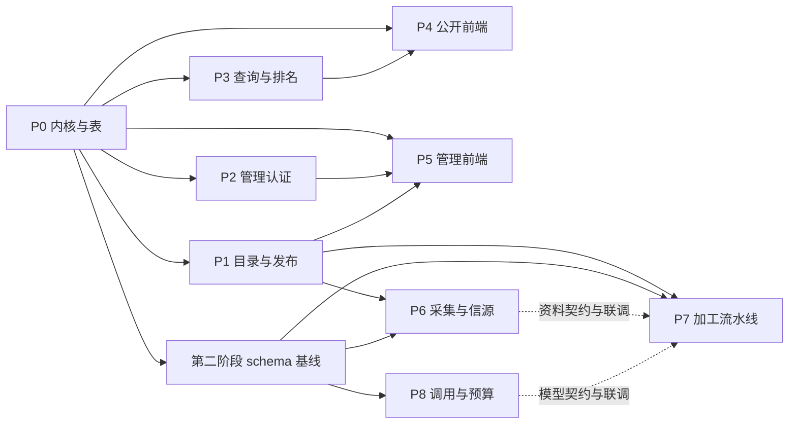

# 工作拆分与冻结契约

本文件把 [Go 后端实施方案](../backend-implementation-plan.md) 和 [数据库表结构](../database-schema.md) 拆成可以并行编写、并行实现的工作包。表字段以数据库文档为准。模块的「表结构增量」必须同步更新数据库文档，并纳入 P0 维护的对应阶段 schema 基线；基线合并后只能通过单独评审的追加迁移变更。

状态：设计，尚未写 Go 代码。日期：2026-10-01。

## 为什么不能按里程碑串行派人

M0 到 M8 是验收顺序，不是人员顺序。查询、管理端、公开前端、采集都要读同一套发布结果，如果各自发明资源和错误结构，合并时会互相改接口。并行的前提是下面三样先冻结，之后各包只加自己的文件：

1. 第一阶段 15 张表的迁移（含本目录声明的增量列）。
2. 公开资源与错误的 JSON 形状（本文后半）。
3. 跨包 Go 端口（本文「端口」）。

业务规则留在各模块文档里实现，不在总契约里再写一遍。

## 工作包

| 编号 | 文档 | 交付 | 第一阶段可并行 | 依赖 |
| --- | --- | --- | --- | --- |
| P0 | [01 平台内核](01-platform-kernel.md) | 模块、配置、迁移、连接池、错误、健康检查、OpenAPI 骨架、River 空进程 | 必须先合并 | 无 |
| P1 | [02 目录与发布](02-catalog-and-publication.md) | 资源聚合、修订、标签、发布事务、种子导入 | 与 P2、P3、P4 并行 | P0 |
| P2 | [03 管理认证](03-admin-auth.md) | 登录会话、CSRF、幂等、审计写入 | 与 P1、P3、P4 并行 | P0 |
| P3 | [04 查询、搜索与排名](04-query-ranking-search.md) | 列表、详情、标签计数、推荐位、行为、热度与推荐快照 | 与 P1、P2、P4 并行 | P0 的表；联调需要 P1 的发布数据 |
| P4 | [05 公开前端](05-public-frontend.md) | 三板块改读接口、真实路由、分页 | 对 OpenAPI 假服务即可并行 | P0 的 JSON 契约 |
| P5 | [06 管理前端](06-admin-frontend.md) | 登录、编辑、发布、标签、推荐位 | 对 OpenAPI 假服务即可并行 | P0 的 JSON 契约；行为见 P1、P2 |
| P6 | [07 采集与信源](07-ingest-and-sources.md) | 原始资料、适配器、检查点、外部推送 | 第二阶段 schema 基线合并后可并行 | P0 第二阶段基线、P1 身份查询端口 |
| P7 | [08 加工流水线](08-editorial-pipeline.md) | 分阶段加工、变更建议、采纳 | 基线合并后与 P6、P8 并行，外部行为使用假实现 | P0 第二阶段基线、P1 发布端口、冻结的资料与模型契约 |
| P8 | [09 外部调用与预算](09-providers-and-budget.md) | 模型端口、回执、预占与结算 | 基线合并后可独立实现与测试 | P0 第二阶段基线，其中含 P6 的 source_runs 和 P7 的 processing_runs |

P4 与 P5 不实现排序公式，只展示服务端给的 `effective_sort`。P3 不写 React。P6 不更新 `resource_publications`。P7 采纳时只调用 P1 的发布门面。P8 不理解资源字段。



## 依赖方向

编译期允许的导入：

```text
cmd/*                  -> httpapi、jobs、各应用服务
internal/httpapi/*     -> 应用服务与 ports
internal/catalog       -> platform
internal/publication   -> catalog、ports
internal/search        -> platform、ports
internal/ranking       -> platform、ports
internal/adminauth     -> platform、ports
internal/ingest        -> platform、ports
internal/sources/*     -> ingest 端口
internal/editorial     -> catalog、platform、ports
internal/providers     -> platform
internal/store         -> sqlc 生成代码与 pgx
internal/ports         -> catalog 的 Kind、ID 类型，不导入 store、http、sources
```

禁止 `catalog` 导入 `ranking`、`search`、`editorial`、`sources`。禁止 `providers` 导入 `editorial`。需要回调时把接口放在 `internal/ports`，实现放在下游。

`db/queries/` 按文件归属，sqlc 生成到 `internal/store/sqlc`，生成文件不手改。各包只改自己的 SQL 文件：

| 文件 | 归属 |
| --- | --- |
| `db/queries/catalog.sql` | P1 |
| `db/queries/auth.sql` | P2 |
| `db/queries/search.sql` | P3 |
| `db/queries/ranking.sql` | P3 |
| `db/queries/ingest.sql` | P6 |
| `db/queries/editorial.sql` | P7 |
| `db/queries/provider.sql` | P8 |

第一阶段迁移文件归 P0。第一阶段验收后，由 P0 续作一个第二阶段 schema 基线 PR，按外键依赖创建全部 13 张第二阶段表，再允许 P6、P7、P8 独立合并实现。可以提前用假实现编码，但空库集成测试与合并依赖该基线。之后只追加迁移，不改已经合并的 up 文件。

## 公开 JSON 契约

时间是 UTC 的 RFC 3339。未知时间是 JSON `null`，不省略必填键。枚举使用下面的英文码，展示文案由前端映射。

### 错误

HTTP 400 校验、401 未登录、403 已登录但无权限、404 不可见、409 版本或幂等冲突、429 限流、503 依赖不可用。

```json
{
  "code": "edit_conflict",
  "message": "内容已被他人更新",
  "request_id": "01J...",
  "field_errors": [{ "field": "slug", "code": "taken" }]
}
```

`field_errors` 没有时为 `[]`。`code` 用蛇形，稳定后不改中文当机器码。列表查询失败不得返回 `items: []` 冒充空结果。

### 枚举

| 名字 | 值 |
| --- | --- |
| kind | `tool` `tutorial` `repo` |
| status | `draft` `published` `hidden` `archived` |
| sort | `recommended` `heat` `latest` `relevance` |
| pricing | `unknown` `free` `paid` `freemium` |
| level | `unknown` `beginner` `advanced` |
| event_type | `detail_view` `outbound_click` |
| tag dimension | `category` `capability` `audience` `difficulty` |

现有原型文案映射：`免费 + 付费` → `freemium`，`付费` → `paid`，`入门` → `beginner`，`进阶` → `advanced`。响应里的 `card.meta` 仍返回中文展示词，筛选参数使用英文码。

### 卡片与详情

`GET /api/v1/resources` 的 `items[]`：

```json
{
  "id": "6f1c...",
  "kind": "tool",
  "slug": "claude",
  "title": "Claude",
  "summary": "Anthropic 出品的 AI 助手",
  "cover_urls": [],
  "cover_fallback_count": 3,
  "tags": [{ "id": "...", "name": "对话", "slug": "chat", "dimension": "capability" }],
  "primary_category": null,
  "quality_score": 0,
  "first_published_at": "2026-09-12T12:00:00Z",
  "content_updated_at": "2026-09-12T12:00:00Z",
  "card": { "subtitle": "claude.ai", "meta": "免费 + 付费", "href": "https://claude.ai", "cta": "访问" }
}
```

`card` 由服务端按 kind 填好，前端不再解析官网域名或拼接 GitHub 链接。

| kind | subtitle | meta | href | cta |
| --- | --- | --- | --- | --- |
| tool | 去掉 `www.` 的主机名 | 收费中文标签 | `details.website_url` | 访问 |
| tutorial | `10 分钟 · 5 步`；没有步骤时只写分钟 | 难度中文标签 | `null` | 查看教程 |
| repo | owner | 语言；空则 `未知语言` | `https://github.com/{full_name}` | GitHub |

详情是卡片字段加上 `aliases`、`body_markdown`、`recommendation_reason`、`details`。教程的 `details.steps` 是字符串数组，`details.notes` 是可选注意。正文和步骤至少一项非空：正文有值时先安全渲染 Markdown，步骤有值时再按顺序展示，两者都要传入 Reader；公开详情与管理预览使用同一规则。收费、难度的英文码放在 `details`，中文只出现在 `card.meta`。

### 列表、标签、推荐位、事件

列表响应：

```json
{
  "items": [],
  "next_cursor": null,
  "has_more": false,
  "total": null,
  "effective_sort": "recommended",
  "ranking_version": null,
  "ranking_computed_at": null,
  "applied_query": { "kind": "tool", "q": "", "tags": [], "sort": "recommended" }
}
```

`total` 算不出就是 `null`。`effective_sort` 可能和请求的 `sort` 不同，例如还没有排名批次时从 `recommended` 降为 `latest`。

`GET /api/v1/tags?kind=&q=` 返回 `{ "tags": [{ "id", "name", "slug", "dimension", "count" }] }`。计数只受 kind 和 q 影响，不受已选 tag 影响。

`GET /api/v1/featured?kind=tool` 返回 `{ "items": [卡片字段 + "position"] }`，只含当前生效且资源仍公开的推荐位。

`POST /api/v1/events` 请求体 `{ "events": [{ "id", "resource_id", "type" }] }`，最多 20 条。响应 202：`{ "accepted": 1, "duplicate": 0 }`。不接受分数字段。

### 管理写入的公共头

改变状态的管理请求带 Idempotency-Key（1 至 128 个可见 ASCII）和 X-CSRF-Token。冲突体使用同一个错误信封。管理幂等记录只与业务结果一起提交为 completed；并发同键请求等待该事务完成，然后重放或在前一事务回滚后取得执行权，不设置 idempotency_in_progress 正常分支。等锁超过上限则回滚当前请求并返回 503 request_busy，客户端使用原键和原请求重试。

采集建议因存在人工草稿而不能应用时使用 draft_conflict；该冲突与 edit_conflict 一样返回 409，不替换草稿。游标签名、条件或有效期不符返回 400 cursor_stale，前端重新从第一页加载。

### 写结果与事务决定

提交行为由操作结果表达，不由 HTTP 状态码或错误码推断：

| 场景 | 回调返回 | 事务结果 |
| --- | --- | --- |
| 直接保存或发布的 edit_version 不符 | error，映射为 409 edit_conflict | 全部回滚，包括未提交的幂等记录 |
| 审核建议发现基线过期或存在人工草稿 | WriteResult{Status:409} 与 nil error，code 为 edit_conflict 或 draft_conflict | 仅提交建议冲突决定、审计及幂等响应；资源修订、投影和草稿不变 |
| 同幂等键不同请求 | error，映射为 409 idempotency_mismatch | 当前事务回滚，既有完成结果保持原样 |
| SQL、证据、审计或入队的技术错误 | error | 全部回滚，不缓存成功响应 |

业务执行途中已经发生写入时，不能把 error 改成 409 结果就提交；要么完整回滚，要么先回到明确的保存点，确保只剩允许持久化的决定。P6 批量推送使用“批次登记、逐条事务与结果记录、最终汇总”的独立协议，不进入管理 WriteExecutor，详见 P6。

## 端口

这些接口放在 `internal/ports`。P0 提交签名和文档注释，方法体由归属包实现。测试使用各包里的 fake，不共享一个大 fake 包。

```go
type Tx interface {
    Within(ctx context.Context, fn func(ctx context.Context, tx pgx.Tx) error) error
}

type Auditor interface {
    Record(ctx context.Context, tx pgx.Tx, event AuditEvent) error
}

type RankingEnqueuer interface {
    // 与发布事务同一 pgx.Tx 入队。kind 为空表示三个板块都刷新。
    Enqueue(ctx context.Context, tx pgx.Tx, kind catalog.Kind, reason string) error
}

type Publisher interface {
    // Tx 方法只使用传入事务，禁止 Begin、Commit 或另开连接写库。
    CreateDraftTx(ctx context.Context, tx pgx.Tx, cmd CreateDraftCommand) (DraftResult, error)
    SaveDraftTx(ctx context.Context, tx pgx.Tx, cmd SaveDraftCommand) (DraftResult, error)
    PublishTx(ctx context.Context, tx pgx.Tx, cmd PublishCommand) (PublishResult, error)
    SetVisibilityTx(ctx context.Context, tx pgx.Tx, cmd VisibilityCommand) error
}

type IdentityLookup interface {
    FindByIdentity(ctx context.Context, kind catalog.Kind, identityKey string) (catalog.ResourceID, bool, error)
}

type ModelClient interface {
    Complete(ctx context.Context, req ModelRequest) (ModelResponse, error)
}

type ModelRequest struct {
    ProcessingRunID uuid.UUID       // 回执外键和任务预算范围，必须非零
    RequestKey      string          // 包含完整输入与 ProfileVersion 的逻辑请求键
    Purpose         string
    Input           json.RawMessage
    SchemaName      string
    ProfileVersion  string          // 不可变的模型、价表、币种和请求策略配置版本
    MaxOutputTokens int             // 有上限的输出预算；P8 验证不超过 profile 限额
}

type ModelResponse struct {
    Output         json.RawMessage
    ProviderCallID *uuid.UUID       // live 必须提供；fixture 为 nil
    Mode           string          // live 或 fixture；disabled 返回错误
}
```

`Publisher` 由 P1 实现。HTTP 管理写命令由 P2 的幂等执行器唯一调用 `Tx.Within`，在回调中把同一 `pgx.Tx` 交给 P1 或 P7 的 `DecideTx`。CLI 导入及后台命令由各自最外层命令调用一次 `Within`。所有叶子 Tx 方法、仓储、审计、建议状态、证据和 River 入队共用该事务，禁止在 context 中隐式切换事务。HTTP 响应只在提交成功后写出。

`DraftResult` 必须返回保存后的 `ResourceID`、`RevisionID` 和新 `EditVersion`；同事务继续发布时使用该新版本。`CreateDraftCommand` 创建资源和首份草稿，避免 P7 调用契约里不存在的 Create。管理端 P5 通过 HTTP 使用这些命令，P7 不写发布表。

P8 根据 `ProfileVersion` 解析固定的供应商、模型、币种和价表，按完整输入及 `MaxOutputTokens` 计算保守预占上限。P7 不传可随意调整的金额；缺 profile、未知价格或非法 run ID 时在发请求前拒绝。请求摘要包含 profile、schema 和输出上限，不能在换模型后复用旧回执。

`ModelClient` 默认使用 `DisabledClient`，返回 `model_disabled`。只有 `development` 或 `test` 且显式开启 `NEX_MODEL_FIXTURE=true` 时使用假客户端；生产禁止 fixture。真实调用要求 `NEX_MODEL_ENABLED=true` 且配置完整。两开关同时为 true 时启动失败。

`AuditEvent` 只含 `ActorType`、`ActorAdminID`、`Action`、`TargetType`、`TargetID`、`Changes`、`RequestID`、`JobID`。`Changes` 在进入端口前已经脱敏。

## 并发协作约定

- 一个 PR 只改一个工作包的目录，外加它拥有的 `db/queries/*.sql` 和 OpenAPI 里它拥有的 path。
- 改 JSON 字段或端口签名时先改本文件，再改实现。
- 集成测试使用 `NEX_TEST_DATABASE_URL`。CI 提供 PostgreSQL 17。测试不访问外网，不调用付费模型。
- 种子数据只允许 `cmd/nexadm import` 写入，测试夹具放在 `server/internal/<pkg>/testdata`。
- 公开查询的生产配置排除 `is_demo`。开发配置默认包含，这样现有 25 条种子在本地可见。

## 建议的前四条 PR

1. P0：空服务能对空库迁移、`/health/ready` 查到数据库、River 事务入队失败能回滚。
2. P1 与 P2 并行：发布事务和登录会话各自有集成测试。
3. P3 与 P4 并行：P3 用 SQL 夹具插发布投影；P4 用 OpenAPI 示例做假服务，页面不依赖 P3 合并。
4. P5 在管理 OpenAPI 示例稳定后开工，可以和 P3 并行。

P6、P7、P8 的设计现在就可以评审。第一阶段验收后先合并第二阶段 schema 基线，再并行合并它们的实现，避免测试依赖尚未建好的外键目标表。
